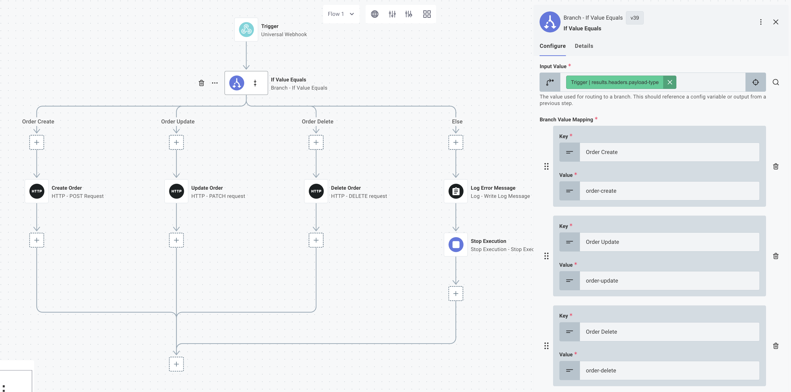
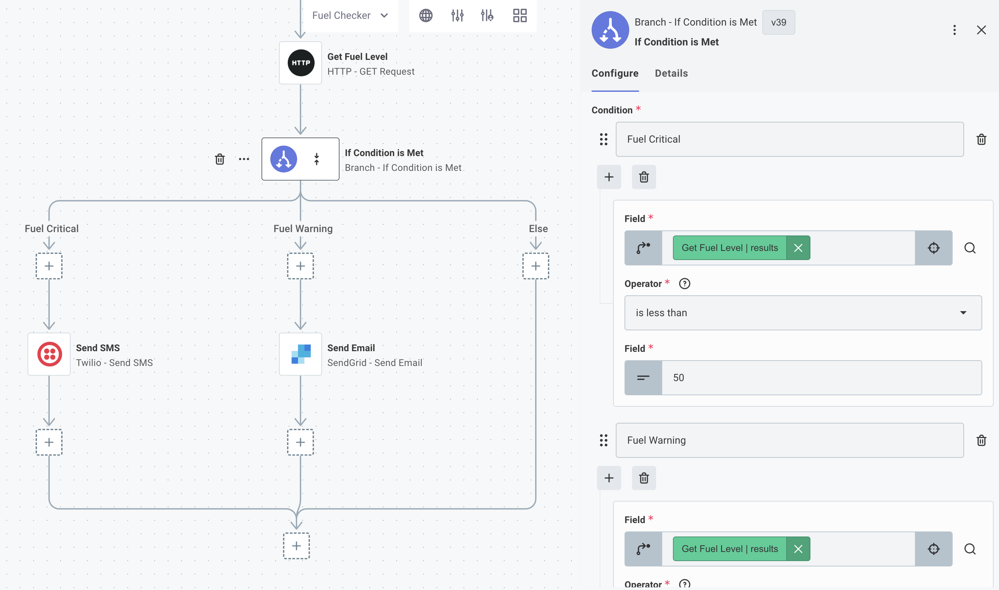
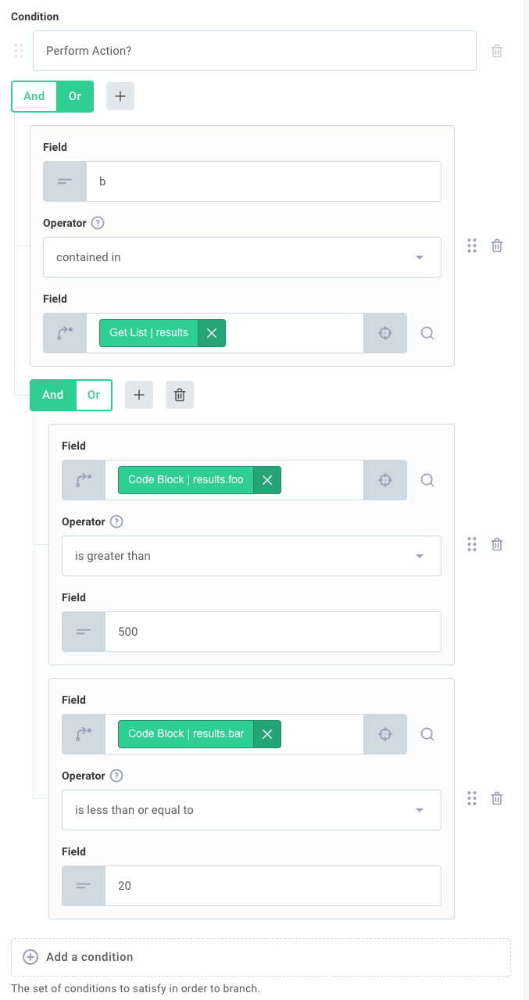
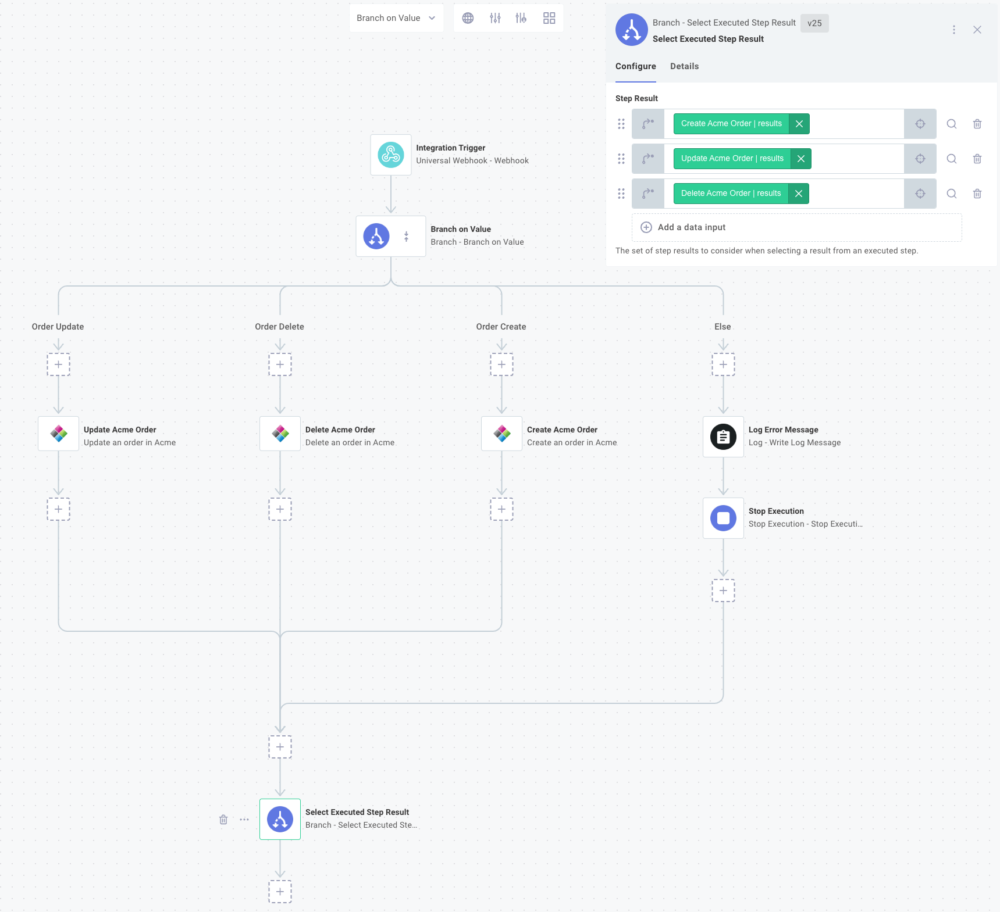

The [branch](./connectors/branch.md) connector allows you to add branching logic to your flow.
Think of **branches** as logical paths that your flow can take.
Given some information about config variables or step results, your flow can follow one of many paths.

Branch actions are useful when you need to conditionally execute some steps.
Here are a couple of examples of things you can accomplish with branching:

**Example 1:** The webhook request your flow receives could contain an "Order Created", "Order Updated", or "Order Deleted" payload.
You need to branch accordingly.

**Example 2:** You want an alert sent when a fuel level drops below a certain threshold.
You can branch into "send an alert" and "fuel level is okay" branches depending on results of a "check fuel level" step.

**Example 3:** You want to upsert data into a system that doesn't support upsert.
You can check if a record exists and branch into "add a new record" or "update the existing record" branches depending on whether the record exists.

## Branching on a value

Adding an [If Value Equals](./connectors/branch.md#branchonvalue) action to your flow allows you to create a set of branches based on the value of some particular variable.
It's very similar to the switch/case construct present in many programming languages.

Consider **Example 1** above.
Suppose the webhook request you receive has a header, `payload-type`, that can be one of three values: `order-create`, `order-update`, or `order-delete`.
You can look at that value and branch accordingly.



## Branching if a condition is met

The [If Condition is Met](./connectors/branch.md#branchonexpression) action allows you to create branches within your flow based on more complex inputs.
You can compare values, like config variables, step results, or static values, and follow a branch based on the results of the comparisons.

Consider **Example 2** above.
You have a step that checks fuel level, and you want to alert different ways depending on how low the fuel level is.
You can express this problem with some pseudocode:

```python
if fuelLevel < 50:
    sendAnSMS()
else if fuelLevel < 100:
    sendAnEmail()
else:
    doNothing()
```

To express this pseudocode in a flow, add a step that looks up fuel level.
Then, add an **If Condition is Met** action to your flow.

Create one branch named **Fuel Critical** and under **Condition Inputs** check that `results` of the fuel level check step **is less than** 50.
Then, create another branch named **Fuel Warning** and check that `results` of the fuel level check step **is less than** 100.

This will generate a branching step that will execute the branch **Send Alert SMS** if fuel levels are less than 50, **Send Warning Email** if fuel levels are less than 100, or will follow the **Else** branch if fuel levels are 100 or above.



## Branch if condition is met operators

You can compare config variables, results from previous steps, or static values to one another using a variety of comparison operators.
These operators each evaluate to `true` or `false` and can be chained together with **And** and **Or** clauses.

### Equals branch operator

The **equals** operator evaluates if two fields are equal to one another, regardless of type.

| Left Field      | Right Field     | Result  | Comments                                                       |
| --------------- | --------------- | :-----: | -------------------------------------------------------------- |
| `5.2`           | `5.2`           | `true`  |                                                                |
| `5.2`           | `5`             | `false` |                                                                |
| `"5.2"`         | `5.2`           | `true`  | Strings are cast to numbers when compared to numbers           |
| `"Hello"`       | `"Hello"`       | `true`  |                                                                |
| `"Hello"`       | `"hello"`       | `false` | String comparison is case-sensitive                            |
| `false`         | `0`             | `true`  | Boolean `false` evaluates to `0`, and `true` evaluates to `1`. |
| `[1,2,3]`       | `[1,2,3]`       | `true`  | Arrays whose elements are the same are considered equal        |
| `{"foo":"bar"}` | `{"foo":"bar"}` | `true`  | Objects with the same keys/values are equal                    |

### Does not equal branch operator

The **does not equal** operator evaluates if two fields are _not_ equal to one another, regardless of type.

| Left Field | Right Field | Result |
| ---------- | ----------- | :----: |
| `5.3`      | `5.2`       |  true  |
| `[1,2,3]`  | `[1,2,4]`   |  true  |

### Is greater than branch operator

The **is greater than** operator evaluates if the left field is greater than the right field and is an implementation of the JavaScript [greater than operator](https://developer.mozilla.org/en-US/docs/Web/JavaScript/Reference/Operators/Greater_than).

| Left Field | Right Field | Result  | Comments                                                                       |
| ---------- | ----------- | :-----: | ------------------------------------------------------------------------------ |
| `5.2`      | `5.3`       | `false` |                                                                                |
| `5.3`      | `5.3`       | `false` | The values are equal; one is not greater than the other                        |
| `"5.3"`    | `5.2`       | `true`  | Strings are cast to numbers when compared to numbers                           |
| `"Hello"`  | `"World"`   | `false` | Strings are compared alphabetically - `"Hello"` does not occur after `"World"` |
| `"hello"`  | `"World"`   | `true`  | The ASCII value for `"h"` occurs [after](https://www.asciitable.com/) `"W"`    |
| `true`     | `false`     | `true`  | `true` (1) is greater than `false` (0)                                         |

### Is greater than or equal to branch operator

The **is greater than or equal to** operator is similar to **is greater than** but also returns true if the values being compared are equal to one another.

| Left Field | Right Field | Result | Comments                                             |
| ---------- | ----------- | :----: | ---------------------------------------------------- |
| `5.3`      | `"5.3"`     | `true` | Strings are cast to numbers when compared to numbers |

### Is less than branch operator

The **is less than** operator evaluates if the left field is less than the right field.

| Left Field | Right Field | Result | Comments                                |
| ---------- | ----------- | :----: | --------------------------------------- |
| `3`        | `4`         | `true` |                                         |
| `"abc"`    | `"daa"`     | `true` | `"a"` is less than `"d"` alphabetically |

### Is less than or equal to branch operator

The **is less than or equal to** operator is similar to **is less than** but also returns true if the values being compared are equal to one another.

### Contained in branch operator

The **contained in** operator evaluates if the value of the left field is contained in the right field.
The right field must be an array or a string.

| Left Field | Right Field       | Result  | Comments                                                          |
| ---------- | ----------------- | :-----: | ----------------------------------------------------------------- |
| `"world"`  | `"Hello, world!"` | `true`  |                                                                   |
| `"World"`  | `"Hello, world!"` | `false` | String comparison is case-sensitive                               |
| `2`        | `[1,2,3]`         | `true`  |                                                                   |
| `"2"`      | `[1,2,3]`         | `false` | The string `"2"` does not occur in the array of numbers `[1,2,3]` |

### Not contained in branch operator

The **not contained in** operator evaluates if the value of the left field does not appear in the right field.

| Left Field | Right Field | Result  |
| ---------- | ----------- | :-----: |
| `2`        | `[1,2,3]`   | `false` |
| `'Hi'`     | `'Hello'`   | `true`  |

### Is empty branch operator

The **is empty** operator evaluates if the given value is an empty string or an empty array.

| Field     | Result  |
| --------- | :-----: |
| `""`      | `true`  |
| `"hello"` | `false` |
| `[]`      | `true`  |
| `[1,2,3]` | `false` |

### Exactly matches branch operator

The **exactly matches** operator evaluates if the two fields are equal to one another, taking the type of the values into consideration.

| Left Field | Right Field | Result  | Comments                                        |
| ---------- | ----------- | :-----: | ----------------------------------------------- |
| `"5"`      | `5`         | `false` | The string `"5"` is not equal to the number `5` |

### Does not exactly match branch operator

The **does not exactly match** operator evaluates if the two fields are not equal to one another, taking the type of the values into consideration.

| Left Field | Right Field | Result | Comments                                        |
| ---------- | ----------- | :----: | ----------------------------------------------- |
| `"5"`      | `5`         | `true` | The string `"5"` is not equal to the number `5` |

### Starts the string branch operator

The **starts the string** operator evaluates if the right field's value begins with the left field's value.
Both right and left values must be strings.

| Left Field | Right Field         | Result  | Comments                                                       |
| ---------- | ------------------- | :-----: | -------------------------------------------------------------- |
| `"Test"`   | `"Testing Value"`   | `true`  |                                                                |
| `"test"`   | `"Testing Value"`   | `false` | Comparisons are case-sensitive                                 |
| `"Test"`   | `"A Testing Value"` | `false` | The right field must start with (not _contain_) the left value |

### Does not start the string branch operator

The **does not start the string** operator returns the opposite of the **starts with** operator.

### Ends the string branch operator

The **ends the string** operator evaluates if the right field ends with the left field.
Both right and left values must be strings.

| Left Field | Right Field     | Result  |
| ---------- | --------------- | :-----: |
| `orld!`    | `Hello, World!` | `true`  |
| `orld`     | `Hello, World!` | `false` |

### Does not end the string branch operator

The **does not end the string** operator returns the opposite of the **ends with** operator.

> **Note: Accepted DateTime Formats**
>
> The following three comparison operators accept date/times as ISO strings (like `2021-03-20` or `2021-03-20T11:52:21.881Z`), Unix epoch timestamps in milliseconds (for example, the number `1631568050` represents a time in 2021-09-13), or `Date()` JavaScript objects.

### Is after (date/time) branch operator

The **is after (date/time)** operator attempts to parse the left and right fields as dates and evaluates if the left field occurs after the right field.

| Left Field                   | Right Field                  | Result  | Comments                                                                          |
| ---------------------------- | ---------------------------- | :-----: | --------------------------------------------------------------------------------- |
| `"2021-03-20"`               | `"2021-04-13"`               | `false` |                                                                                   |
| `"2021-03-20T12:50:30.105Z"` | `"2021-03-20T11:52:21.881Z"` | `true`  | When dates are equivalent, time is compared                                       |
| `"2021-03-20"`               | `1631568050`                 | `false` | `1631568050` is the UNIX epoch time for 2021-09-13, which occurs after 2021-03-05 |

### Is before (date/time) branch operator

The **is before (date/time)** operator attempts to parse the left and right fields as dates and evaluates if the left field occurs before the right field.

### Is the same (date/time) branch operator

The **is the same (date/time)** operator attempts to parse the left and right fields as dates and evaluates if the timestamps are identical.

| Left Field                   | Right Field                  | Result  | Comments                                                                               |
| ---------------------------- | ---------------------------- | :-----: | -------------------------------------------------------------------------------------- |
| `"2021-03-20T12:50:30.105Z"` | `"2021-03-20T12:50:30.105Z"` | `true`  |                                                                                        |
| `"2021-03-20T12:50:30Z"`     | `1616244630000`              | `true`  | `1616244630` is the millisecond UNIX epoch representation of `March 20, 2021 12:50:30` |
| `"2021-03-20T12:50:30Z"`     | `"2021-03-20T12:50:31Z"`     | `false` |                                                                                        |

### Is true branch operator

The **is true** operator evaluates if an input field is "truthy".

Common "truthy" values include `true`, `"true"`, `"True"`, `"Yes"`, `"yes"`, `"Y"`, and `"y"`.

Common "falsy" values include `false`, `"false"`, `"False"`, `"No"`, `"no"`, `"N"`, and `"n"` and evaluate to `false`.
Other values that evaluate to `false` are `0`, `null`, `undefined`, `NaN`, and `""`.

All other values (a non-zero number, a non-empty string, any array or object, etc.) evaluate to `true`.

| Field     | Result  |
| --------- | :-----: |
| `"Yes"`   | `true`  |
| `"True"`  | `true`  |
| `[]`      | `true`  |
| `{}`      | `true`  |
| `"Hello"` | `true`  |
| `-5`      | `true`  |
| `"n"`     | `false` |
| `false`   | `false` |
| `""`      | `false` |
| `null`    | `false` |
| `0`       | `false` |

### Is false branch operator

The **is false** operator returns the opposite of the **is true** operator.

### Does not exist branch operator

The **does not exist** operator evaluates to `true` if the presented value is one of the following: `undefined`, `null`, `0`, `NaN`, `false` or `""`.

| Field       | Result  |
| ----------- | :-----: |
| `undefined` | `true`  |
| `NaN`       | `true`  |
| `1`         | `false` |
| `"Hello"`   | `false` |

### Exists branch operator

The **exists** operator returns the opposite of the `does not exist` operator.

## Combining multiple comparison operators

Multiple expressions can be grouped together with **And** or **Or** clauses, which execute like programming **and** and **or** clauses.
Take, for example, this programming expression:

```txt
if ((foo > 500 and bar <= 20) or ("b" in ["a","b","c"]))
```

The same logic can be represented with a group of conditionals in an [If Condition is Met](./connectors/branch.md#branchonexpression) action:



## Converging branches

Regardless of which branch is followed, branches always converge to a single point.
Once a branch has executed, the flow will continue with the next step listed below the branch convergence.

This presents a problem: how do steps below the convergence reference steps in branches that may or may not have executed (depending on which branch was followed)?
In your flow you may want to say "if branch _foo_ was executed, get the results from _step A_, and if branch _bar_ was executed, get the results instead from _step B_."
The [Select Executed Step Result](./connectors/branch.md#selectexecutedstepresult) action handles that scenario.

Imagine that you have two branches - one for incoming invoices, and one for outgoing invoices, with different logic contained in each.
Regardless of which branch was executed, you'd like to insert the resulting data into another system.
You can leverage the **Select Executed Step Result** action to say "get me the incoming or outgoing invoice - whichever one was executed."
This action iterates over the list of step results that you specify, and returns the first one that has a non-null value (which indicates that it ran).



Within the step configuration drawer, select the step(s) whose results you would like, and the **Select Executed Step Result** step will yield the result of whichever one was executed.
