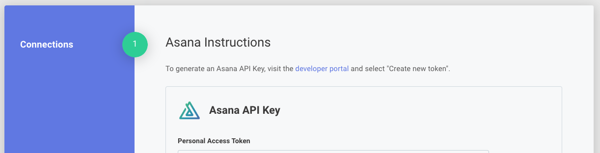
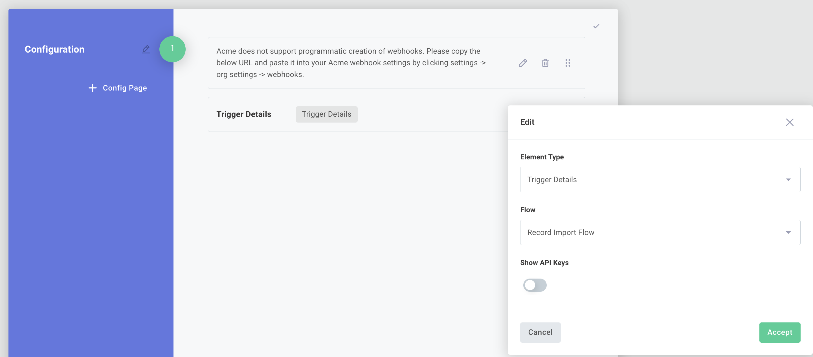
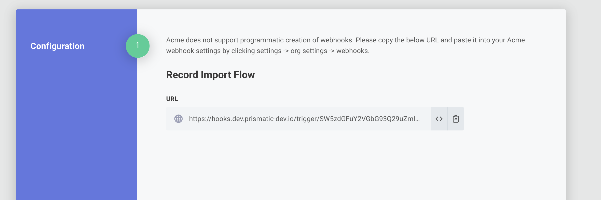

## Config pages overview

When you deploy a %INSTANCE% of an %INTEGRATION%, you work through a **Configuration Wizard**.
The wizard is split into one or more **Configuration Pages**, each of which can contain config variables, helper text, and images.

If your %INTEGRATION% requires manual configuration of webhooks, the config wizard can also display the %INSTANCE%'s webhook endpoints and API keys.

You design the wizard from inside the **Config Wizard Designer** in the %EMBEDDED_DESIGNER%.

You can add a configuration page by clicking **+ Config Page**, and you can rename a config page or add a short description to the page by clicking the pencil icon beside the page.

> **Tip: Connection config variables go on the first page**
>
> Connection config variables can only be added to the first config page.
> Subsequent pages can use the connection to dynamically generate other config variables (for example, a dropdown menu of records pulled from the third-party app).

## Displaying additional helper text in the configuration wizard

To add **helper text**, including headings (H1 - H6) or paragraphs, click the **+ Text/Image** button and select the type of text you'd like to add.

To add an **image**, your image will need to be publicly accessible online.
Enter the public URL of the image you'd like shown on your config page.

For further customization, you can choose to add **Raw HTML** to your config page.

## Displaying webhook information in the configuration wizard

A %INSTANCE%'s webhook endpoints and API keys can be displayed in the configuration wizard.
Click **+ Text/Image** and then select **Trigger Details** as the **Element Type**.
You can opt to show all flows' URLs, or the URL for a specific flow.

When you deploy a %INSTANCE%, the webhook information is shown on the configuration page.
This is helpful when you need to manually configure webhooks in a third-party app.

