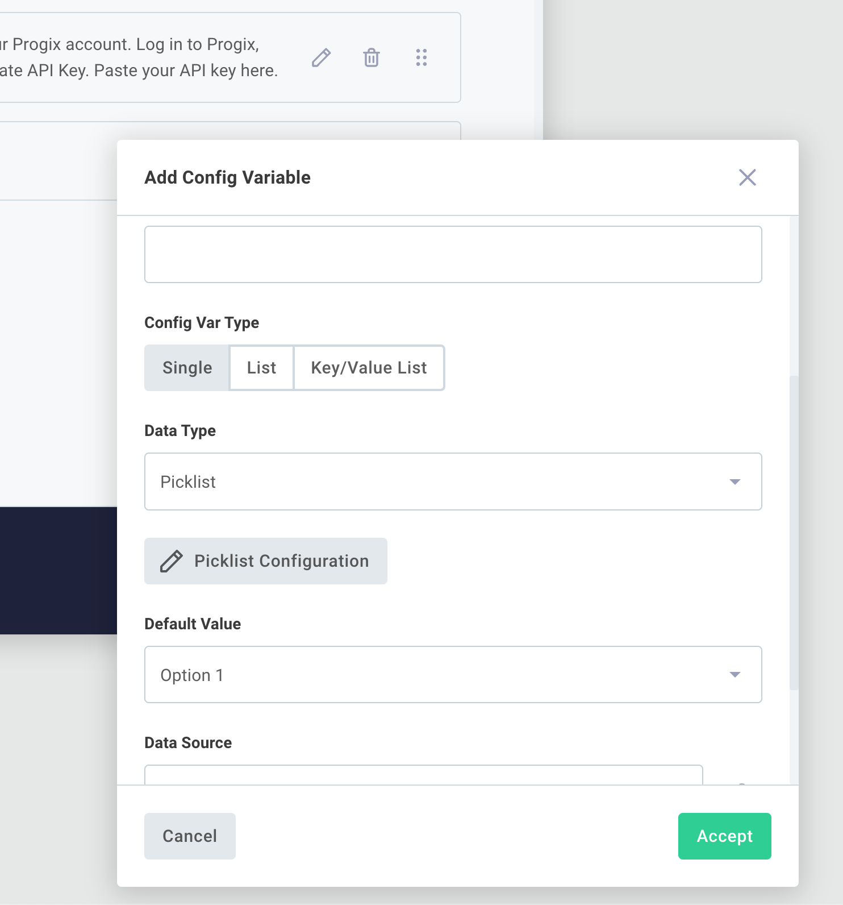
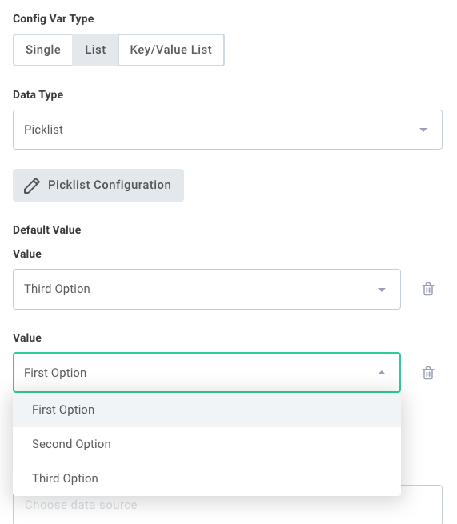
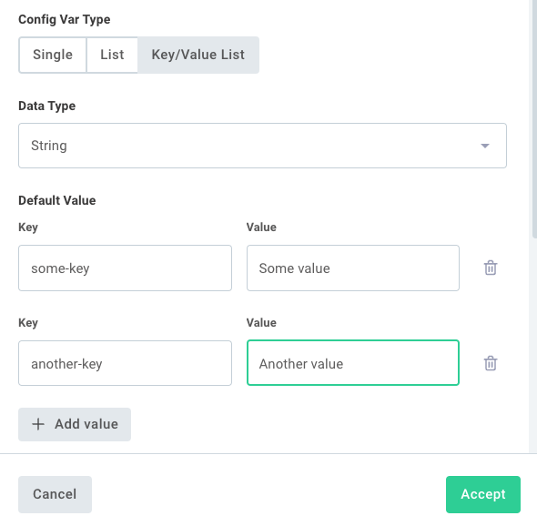
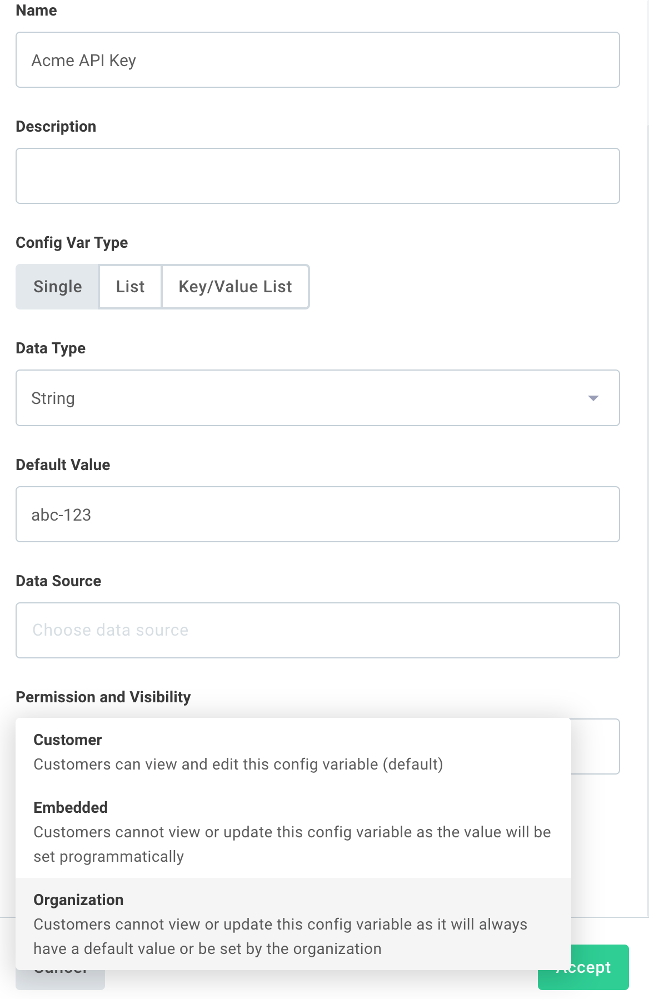
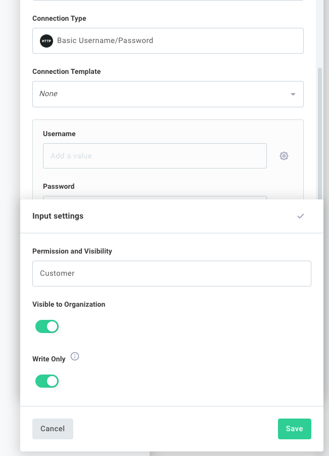
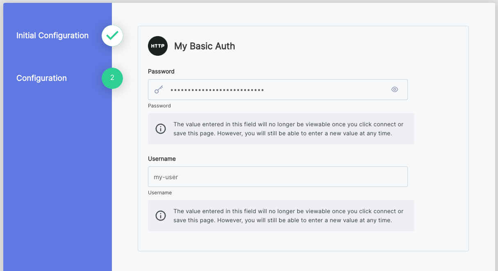
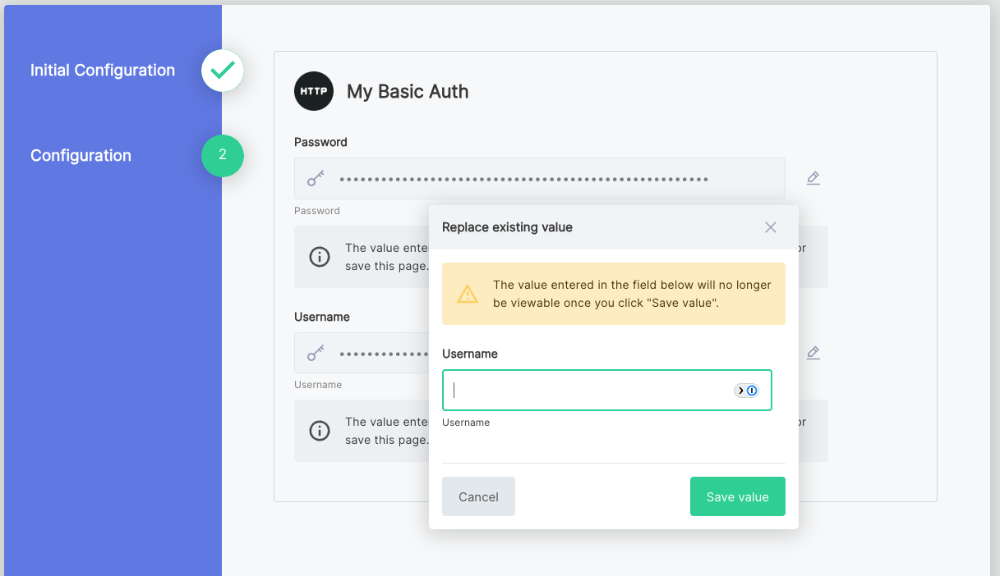

You can define names, descriptions, variable types, and optional default values of config variables for your configuration wizard from the config wizard designer.
Once defined, you reference the values supplied for each config variable as inputs to steps in your flows.



When you (or anyone else on your team) deploy a %INSTANCE%, the config wizard collects the values for each config variable and tailors the %INTEGRATION% to that %INSTANCE% - without anyone having to edit the %INTEGRATION% itself.

Config variables that you define in the config variable drawer can be used within your %INTEGRATION% as [step inputs](../passing-data-between-steps.md#config-variable-inputs), or through the [Branch](../branching.md) connector to drive branching logic.

> **Tip: Use only letters, numbers and spaces as config variable names**
>
> The config variable name is used to reference the config variable's value.
> Please use only letters, numbers and spaces as config variable names.
>
> If you have a config variable name like `MyApp.com Connection`, the `.` character can make config variable references difficult, since `configVars.MyApp.com Connection` is ambiguous - it's unclear if `com Connection` is a property of config variable `MyApp`, or if `MyApp.com Connection` is the full config variable name.
> Some connectors may throw an error if they encounter a config variable with a `.` character.

## Config variable data types

There are several types of configuration variables:

- **String** is a standard string of characters.
- **Date** follows the form `mm/dd/yyyy`, and presents a calendar widget to choose a date.
- **Timestamp** follows the form `mm/dd/yyyy, HH:MM [AM/PM]`, and presents a calendar and time widget to choose a date and time.
- **Picklist** allows you to define a series of options to choose from.
  Picklists are presented as a dropdown menu of options.
  A picklist value can be up to 64 characters in length.
- **Code** lets you enter JSON, XML, or other formatted code blocks.
  This is helpful if a %INSTANCE% uses a unique format for recurring reports or other formatted documents.
  Choose a Code Language when you create the config variable for syntax highlighting.
- **Boolean** offers a true/false toggle.
- **Number** accepts a number (integer or decimal).
- **Object Selection** lets you select zero or more objects from a list.
  This config variable type always sources data from a data source.
- **Object Field Map** lets you map a series of fields.
  This config variable type always sources data from a data source.
- **JSON Form** allows you to leverage [JSON Forms](https://jsonforms.io/) for a richer configuration UI.
- **Connection** is made up of multiple fields that determine how a connector should connect to an external API.
  It might include a username, password, API key, endpoint URL, or several other things.
  Note that connection config variables can only be added to the first config page, as subsequent pages may use the connection to dynamically generate other config variables.

> **Tip: Inputs are sent to actions as strings**
>
> The type of config variable you choose affects the UI in the config wizard (toggles for booleans, date pickers for timestamps, an editor with syntax highlighting for code, etc).
> Regardless of what type of config variable you choose, all values are presented to actions as strings.

Once you've added a config variable, you can use it as an input to actions within your flows.

### List and key/value list config variables

In addition to representing a **single** value, some config variable types can represent a **list** of values, or a list of **key/value pairs**.
This is helpful when you want to enter an unknown number of items as the values of a config variable.
For example, you may want to select one or more values from a **picklist** menu.

Config variables with a data type of **string**, **date**, **timestamp**, **picklist**, **code**, or **boolean** can be configured as lists or key/value lists.

To create a **list** config variable, create a new config variable and select **LIST** under **Config Var Type**:



When a list config variable is referenced by a step's input, that step's action receives a JavaScript array of values.

To create a **key/value list** config variable, create a new config variable and select **KEY/VALUE LIST** under **Config Var Type**:



When a **list** config variable is referenced by a step, the config variable contains an array of strings like `["First Option", "Third Option", "Second Option"]`.

When a **key/value list** config variable is referenced by a step, the config variable contains an array of key/value pairs:

```javascript
[
  { key: "some-key", value: "Some value" },
  { key: "another-key", value: "Another value" },
];
```

## Config variable visibility

By default, config variables you add to your config wizard are visible and editable when you deploy a %INSTANCE%.
But in some situations you may want a value to be hidden from the wizard UI - for example, when a value is supplied automatically by %COMPANY_CORE_PRODUCT%, or when an organization-wide default is set on your behalf.

To configure visibility, open the config wizard designer and select a config variable.
Then, select an option from the **Permission and Visibility** dropdown menu.
You have three options:

- **Customer** is the default value.
  The config variable appears in the config wizard and you can view and edit it when deploying a %INSTANCE%.
- **Embedded** hides the config variable from the wizard UI, but lets %COMPANY_CORE_PRODUCT% set it programmatically through the embedded SDK when a %INSTANCE% is deployed.
  This is useful for values that %COMPANY_CORE_PRODUCT% supplies automatically (a tenant ID, an API key for an internal service, and so on).
- **Organization** hides the config variable entirely.
  The value comes from a default that's set centrally and cannot be changed when deploying a %INSTANCE%.
  Config variables marked **organization** must have a default value.



## Connection config variables

Connections are a special type of config variable that contain the information necessary to connect to a third-party application.
A connection might include a simple username and password pair, or might declare all the fields required for OAuth 2.0 (like auth URL, client ID, etc.).

Read more in the [Connections overview](../connections/overview.md).

### Write-only connection inputs

In some situations, it can be helpful to make a connection input **write-only** (a user can write a value, but not read it).

For example, suppose Bob and Sue are two team members in the same organization.
Sue is an administrator for a third-party app, and Bob is not, but Bob knows more about the %INTEGRATION%'s configuration.
It's helpful to have Sue enter her credentials when the %INSTANCE% is first deployed, while still letting Bob reconfigure the rest of the %INSTANCE% later.
By making the connection inputs write-only, Bob can update other config variables without ever being able to see the credentials Sue entered.

To configure a connection's input to be write-only, open a connection config variable within the config wizard designer and click the gear icon next to an input.
Toggle **Write Only**.



> **Note:** Once you set a connection input to **Write Only** and save your %INTEGRATION%, you will be unable to disable the write-only setting.

The first time a %INSTANCE% is deployed, the inputs appear normally with text indicating that the values are write-only.



When the %INSTANCE% is reconfigured later, the sensitive values are not accessible via the API and masked placeholders are presented instead.
A user can choose to overwrite a write-only value with a new value, but cannot view the existing one.



## Config variable limits

An %INTEGRATION% can have up to 100 config variables.
If you need more than 100 config variables, consider whether some of them can be combined into a single config variable.
