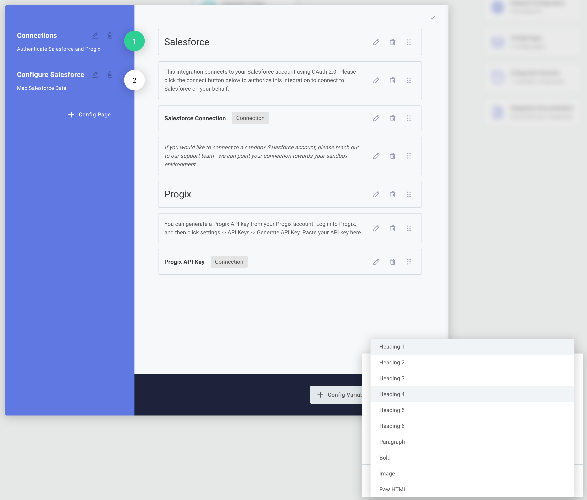

The %INTEGRATION_PLURAL% you build are meant to be reusable.
The same %INTEGRATION% should be deployable in multiple environments (development versus production, for example) and against multiple third-party accounts, without you having to rebuild it each time.
The **Config Wizard** is how you parameterize an %INTEGRATION%: you define the values that vary between %INSTANCE_PLURAL%, and you fill those values in each time you deploy a new %INSTANCE%.

When you deploy a %INSTANCE% of your %INTEGRATION%, you work through the configuration wizard you designed - authenticating with third-party apps and providing any additional information the %INTEGRATION% needs to run.
Some %INTEGRATION_PLURAL% have simple wizards that only require third-party authentication; others may involve multiple pages with dynamically generated dropdown menus, toggles, text fields, and other input types.

## How the config wizard fits into your %INTEGRATION%

The flows and steps you build inside the %EMBEDDED_DESIGNER% form the static structure of your %INTEGRATION%.
The config wizard captures the parts that vary from one %INSTANCE% to the next.

A typical config wizard contains:

- **[Connection config variables](../connections/overview.md)** for each third-party application your %INTEGRATION% talks to.
  You authenticate with these apps once per %INSTANCE%, and the same connection is then used by every step that needs it across every flow.
- **[Config variables](./config-variables.md)** of various types - strings, dropdowns sourced from third-party APIs, toggles, dates, and more - that capture the values your flows need to run.
- **Helper text and images** to guide you through filling in each page.

When the wizard is complete and you activate the %INSTANCE%, the values you entered become available to every flow in the %INTEGRATION%, and triggers begin running.

## Designing your config wizard

Open the **Config Wizard Designer** from the top of the %EMBEDDED_DESIGNER%.

From here you can:

- Add and reorder [config pages](./config-pages.md).
- Add [config variables](./config-variables.md) to each page.
- Add helper text and images to clarify each page.
- Preview how the wizard will appear when you (or anyone else on your team) deploy a %INSTANCE%.

## Testing your config wizard

You can test the config wizard from inside the %EMBEDDED_DESIGNER% before publishing.
In the [Test Runner](../testing.md) drawer, click **Test Configuration** and select **Test-instance configuration** to fill in the same wizard you'll see when deploying a real %INSTANCE%.

The values you enter persist across test runs, so you only need to fill in the wizard once per round of changes.
