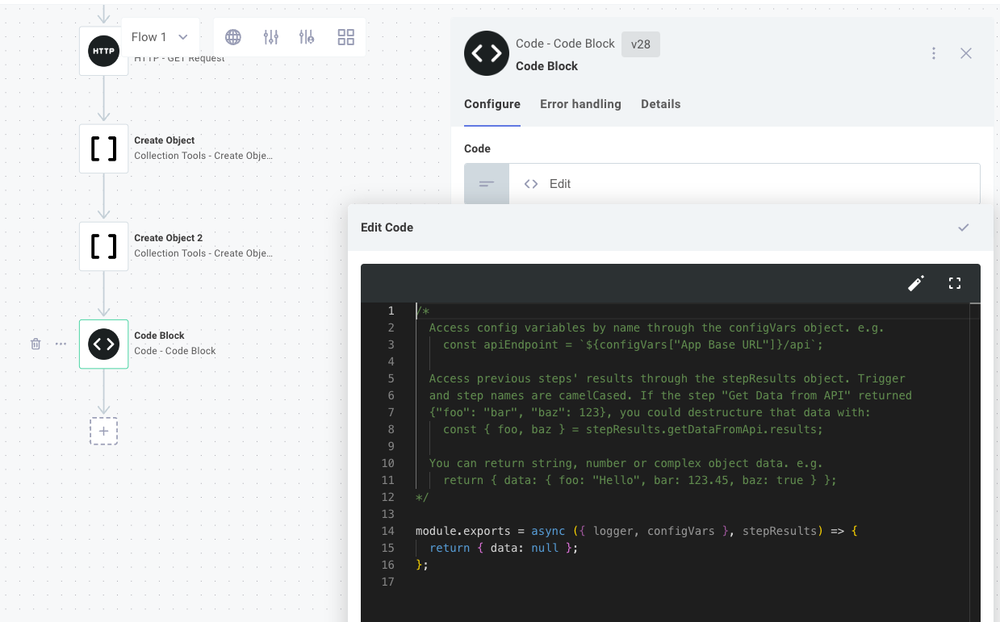
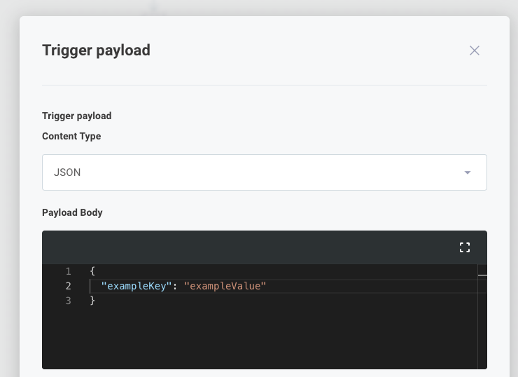
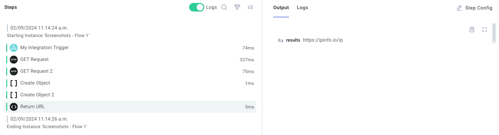

The [code](./connectors/code.md) connector allows you to write short custom JavaScript functions within your flow.
This is helpful if you have some coding experience and want to manipulate data with code that isn't easily expressed using built-in connectors.

## When to use the code connector

You will likely have logic that can't be solved using the standard connectors.
Short, %INTEGRATION%-specific JavaScript can be written using the code connector.

The code connector is useful when:

- Your code does not depend on external libraries
- Your code is short and succinct
- Your code is step-specific and not reusable elsewhere

## Adding a code step to a flow

Within the designer, [add a step](./steps.md#adding-steps-to-a-flow) to your flow.
Select the **Code** connector, **Code Block** action.

A new code step appears in your flow.
Click the **Edit** button to open the code editor.



## Code structure

The code connector provides a stub function by default.
Let's examine the structure of the code:

```javascript
module.exports = async ({ logger, configVars }, stepResults) => {
  return { data: null };
};
```

The code connector requires you to export an asynchronous function.
The default code uses [arrow function notation](https://developer.mozilla.org/en-US/docs/Web/JavaScript/Reference/Functions/Arrow_functions) to create an `async` function to export.
If you're used to standard JavaScript function notation, this is the same as:

```javascript
async function myFunction({ logger, configVars }, stepResults) {
  return { data: null };
}

module.exports = myFunction;
```

## Code step parameters

This function is provided two parameters:

1. The first positional parameter (often named `context`) contains several properties:
   - `logger` allows you to write log lines.
   - `configVars` lets you access [config variables](./config-wizard/config-variables.md) (including connections).
   - `instanceState`, `crossFlowState`, `integrationState`, and `executionState` give you access to persisted state at different scopes.
   - `stepId` is the ID of the current step being executed.
   - `executionId` is the ID of the current execution.
   - `webhookUrls` contains the URLs of the running %INSTANCE%'s sibling flows.
   - `webhookApiKeys` contains the API keys of the running %INSTANCE%'s sibling flows.
   - `invokeUrl` is the URL used to invoke the flow.
   - `customer` is an object containing an `id`, `name`, and `externalId` identifying the account that owns the %INSTANCE%.
   - `instance` is an object containing an `id` and `name` of the running %INSTANCE%.
   - `flow` is an object containing the `id` and `name` of the running flow.
2. The second positional parameter, `stepResults`, is an object that contains output from previous steps of the flow.

### Logging

The `context.logger` object can be used for logging and debugging.
`context.logger` has four functions: `debug`, `info`, `warn`, and `error`.
For example:

```javascript
module.exports = async (context, stepResults) => {
  context.logger.info("Things are going great");
  context.logger.warn("Now less great...");
};

// or

module.exports = async ({ logger }, stepResults) => {
  logger.info("Hello World");
};
```

> **Note:** Log lines are truncated after 4096 characters.

### Config variables

`context.configVars` provides the code step with access to all [config variables](./config-wizard/config-variables.md), including connections, associated with the %INTEGRATION%.

If you have a config variable named `Acme API Endpoint`, for example, you could reference that config variable in a code step like this:

```javascript
module.exports = async ({ configVars }, stepResults) => {
  const apiUrl = `${configVars["Acme API Endpoint"]}/users`;
  // ...
};
```

### Connections

[Connections](./connections/overview.md) are a special type of config variable.
You can access the contents of a connection the same way that you would any other config variable.
In this example, suppose you have a connection config variable named `Acme Connection` that contains two fields, `tenantId` and `apiKey`:

```javascript title="Destructuring a connection config variable"
module.exports = async ({ logger, configVars }, stepResults) => {
  const {
    fields: { tenantId, apiKey },
  } = configVars["Acme Connection"];
  // ...
};
```

## Referencing previous step outputs

Most steps of a flow return some sort of value.
An **HTTP - GET** action, for example, might return a JSON payload from a REST API.
An **Amazon S3 - Get Object** will return a binary file pulled from S3.

The code connector can reference those outputs through the `stepResults` parameter.
`stepResults` is an object that contains results from all previous steps.

For example, if you have an **HTTP - GET** step named **Fetch Users List** that pulls down an array of users from `https://jsonplaceholder.typicode.com/users`, you can generate an array of email addresses with this code:

```javascript
module.exports = async (context, stepResults) => {
  const userArray = stepResults.fetchUsersList.results;
  const emailArray = userArray.map((user) => user.email);
  return { data: emailArray };
};
```

> **Tip: Step results are often objects**
>
> Many connectors return objects that have multiple keys.
> So, you can reference `stepResults.myStepName.results.someKey`.
> It's rare for a connector to return serialized JSON, so there's rarely a need to `JSON.parse()` results from a previous step.

### Previous step names as variables

Since names of steps can include spaces and non-JavaScript-friendly characters, alphanumeric characters of step names are converted to camelCase.
So, a step named **Download JSON from API** would be converted to **downloadJsonFromApi**.

Here are a few examples of step names and their corresponding step result reference:

| Step name                  | Code reference                            |
| -------------------------- | ----------------------------------------- |
| `My Step Name`             | `stepResults.myStepName.results`          |
| `my step name`             | `stepResults.myStepName.results`          |
| `HTTP - GET`               | `stepResults.httpGet.results`             |
| `Fetch 🚀 rocket launches` | `stepResults.fetchRocketLaunches.results` |

### Referencing flow trigger payload data

The flow trigger is another step that can have a unique name.
Suppose a flow is triggered by a webhook, the trigger is named `My Flow Trigger`, and the webhook is provided a payload `body.data` of `{"exampleKey": "exampleValue"}`.



That `exampleKey` would be accessible using `stepResults.myFlowTrigger` like so:

```javascript
module.exports = async ({ logger }, stepResults) => {
  const exampleKey = stepResults.myFlowTrigger.results.body.data.exampleKey;
  logger.info(`Received '${exampleKey}'`);
};
```

Using JavaScript destructuring, you can instead write this:

```javascript
module.exports = async (
  { logger },
  {
    myFlowTrigger: {
      results: {
        body: {
          data: { exampleKey },
        },
      },
    },
  },
) => {
  logger.info(`Received '${exampleKey}'`);
};
```

## Code step return values

The code connector can optionally return a value for use by a subsequent step.
The return value can be an object, string, integer, etc., and will retain its type as the value is passed to the next step.

The return value is specified using the `data` key in the return object.

In this example, we return a string with value `"https://ipinfo.io/ip"`:

```javascript
module.exports = async (context, stepResults) => {
  return { data: "https://ipinfo.io/ip" };
};
```

The output can be used as input for the next step by referencing `theCodeStepsName.results`.



### Returning binary data from a code step

Sometimes you'll want your code step to return binary data (like a rendered image or PDF).
To do that, return an object with a `data` property of type `Buffer` (a file buffer), and a `contentType` property of type `String` that contains the file's [MIME type](https://developer.mozilla.org/en-US/docs/Web/HTTP/Basics_of_HTTP/MIME_types/Common_types):

```javascript
module.exports = async (context, stepResults) => {
  // ...
  const fileBuffer = SomePdfLibrary.generatePdf();
  return {
    data: fileBuffer,
    contentType: "application/pdf",
  };
};
```

## Making HTTP calls from a code step

The Node.js [fetch](https://developer.mozilla.org/en-US/docs/Web/API/fetch) API is built into the code connector.
To make an HTTP call to an API, you can use the `fetch` function:

```javascript title="Make an HTTP POST request from a code step"
module.exports = async (context, stepResults) => {
  const response = await fetch("https://postman-echo.com/post", {
    method: "POST",
    headers: {
      Accept: "application/json",
      "Content-Type": "application/json",
      Authorization: "Bearer abc-123",
    },
    body: JSON.stringify({ foo: "bar", baz: 123 }),
  });
  const parsedData = await response.json();
  return { data: parsedData };
};
```

## Adding dependencies to a code step

If your code step depends on node modules from `npm`, dependencies will be dynamically imported from the [UNPKG](https://unpkg.com/) and [jsDelivr](https://www.jsdelivr.com/) CDNs.
For example, if your code step reads:

```javascript title="Import lodash as a dependency"
const lodash = require("lodash@4.17.21/lodash.js");

module.exports = async (context, stepResults) => {
  const mergedData = lodash.merge(
    { cpp: "12" },
    { cpp: "23" },
    { java: "23" },
    { python: "35" },
  );
  return { data: mergedData };
};
```

Then [lodash](https://unpkg.com/browse/lodash@4.17.21/lodash.js) version 4.17.21 will be imported as a dependency.

You should specify specific known working versions of `npm` packages for your code step:

```javascript
const lodash = require("lodash@2.4.2");
const { PDFDocument } = require("pdf-lib@1.17.1/dist/pdf-lib.js");
```

You can require any file from `npm` using `package[@version][/file]` syntax.
Note that with the `lodash` import above, no file was specified.
If no file is specified, the `main` file defined in the `npm` package's `package.json` is imported.
An explicit path was called out for the `pdf-lib` import because the `pdf-lib` package defaults to importing an index file that itself requires other files, and `dist/pdf-lib.js` is a completely independent file that can be imported on its own.

> **Warning: Downstream dependencies**
>
> In order for an external dependency to be compatible with a code step, all JavaScript code must be compiled into a single file.
>
> For example, [https://unpkg.com/lodash@4.17.20/lodash.js](https://unpkg.com/lodash@4.17.20/lodash.js) contains all of the code necessary to run in a single file.
> [https://app.unpkg.com/lodash@4.17.20/files/flatten.js](https://app.unpkg.com/lodash@4.17.20/files/flatten.js) does not - it has its own `require()` statement and depends on other files.
> The former would work in the code step, the latter would not.
>
> If the external package has its own dependencies that are not compiled in, or if the file you reference has its own `require()` statements, you will see errors.

> **Warning: CDN outages can cause downtime**
>
> When a `require()` line is encountered in a code step, the code step will attempt to download the dependency from the UNPKG CDN.
> If UNPKG is down or otherwise unavailable, the code step will fall back to downloading the dependency from the jsDelivr CDN.
> If both CDNs are down, your code step will error.

### Requiring built-in Node.js modules

You can also require built-in Node.js modules, like `crypto` or `path`.
If the library you specify is built in to Node.js, the client will _not_ reach out to a CDN, and will instead use the built-in module.

```javascript
const crypto = require("crypto");

module.exports = async () => {
  const { publicKey, privateKey } = crypto.generateKeyPairSync("rsa", {
    modulusLength: 4096,
    publicKeyEncoding: {
      type: "spki",
      format: "pem",
    },
    privateKeyEncoding: {
      type: "pkcs8",
      format: "pem",
      cipher: "aes-256-cbc",
      passphrase: "top secret",
    },
  });

  return {
    data: {
      publicKey,
      privateKey,
    },
  };
};
```
