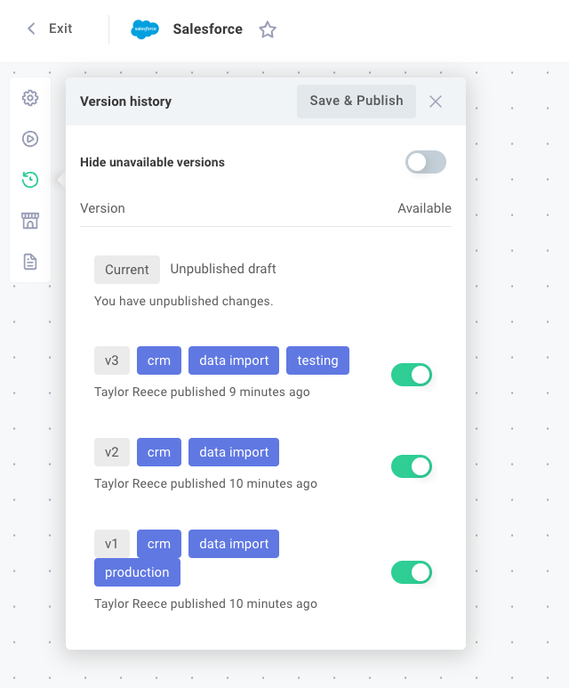

While you're building, your %INTEGRATION% lives as an editable draft inside the %EMBEDDED_DESIGNER%.
When you're satisfied it works as expected, you publish a version and deploy a %INSTANCE% - the production-ready, running copy of your %INTEGRATION% that processes real data on its trigger schedule or webhook URLs.

## Publishing a version

To publish your %INTEGRATION%, open the **Version history** tab on the left side of the designer.
If you have unpublished changes, you'll see an **Unpublished Draft** listed among the %INTEGRATION%'s versions.
Enter a note describing your changes, then click **Save & Publish** to release a new version.

Each new version is a snapshot of your %INTEGRATION% at the point of publish.
A %INSTANCE% you've already deployed continues to run on whatever version it was deployed against until you explicitly upgrade it - new draft changes are not visible to a running %INSTANCE% until you publish and upgrade.

## Available and unavailable versions

%INTEGRATION% versions can be marked **Available** or **Unavailable** using the toggles to the right of each version.
Marking a version **Unavailable** prevents it from being deployed as a new %INSTANCE%.

This is useful if you discover a bug in a published version - you can flip the version to **Unavailable** to prevent further deployments while you work on a fix.

## Deploying a %INSTANCE%

Once a version is published and marked Available, you can deploy a %INSTANCE% by working through the [Config Wizard](./config-wizard/overview.md) - the same wizard you designed inside the %EMBEDDED_DESIGNER%.
You authenticate with the third-party apps the %INTEGRATION% needs and fill in any other configuration values you defined as [config variables](./config-wizard/config-variables.md).

You can deploy more than one %INSTANCE% of the same %INTEGRATION% if you need to.
For example, you might run a separate %INSTANCE% for development and production, or one %INSTANCE% per third-party account you want the %INTEGRATION% to talk to.
Each %INSTANCE% has its own config wizard answers, its own webhook URLs, and its own execution history.

When a %INSTANCE% is activated:

- Schedule-triggered flows start running on their configured schedules.
- Webhook-triggered flows begin listening for incoming webhook requests at their unique production URLs.
- Any flow with an [Instance Deploy](./triggering.md#instance-management-triggers) trigger executes once.

When you remove a %INSTANCE%, its schedule and webhook triggers stop running, and any flow with an [Instance Remove](./triggering.md#instance-management-triggers) trigger executes once for cleanup.
