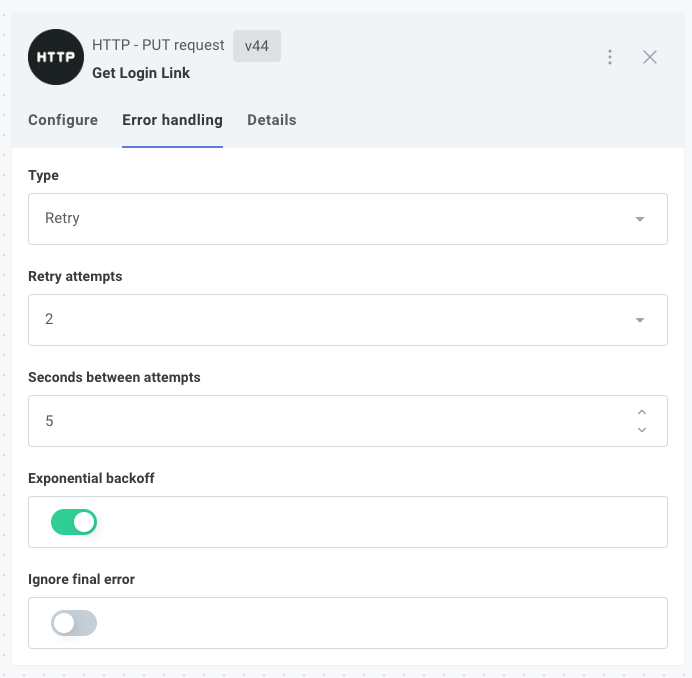
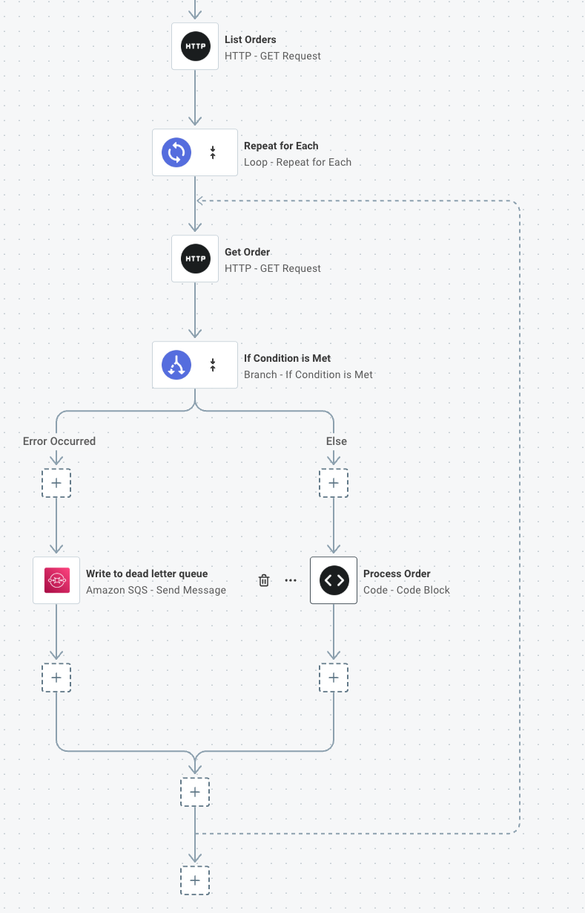

Flows interact with external systems that can experience temporary failures, timeouts, or unexpected responses.
The %EMBEDDED_DESIGNER% provides error handling mechanisms at both the flow and step level to gracefully handle these situations and improve %INTEGRATION% reliability.

## Handling errors

Errors happen.
An API you integrate with may encounter a temporary outage, or the "eventually" part of an "eventually consistent" database may need a couple more seconds to save a record.
When you encounter errors, you have two tools to handle them:

1. Flow-level error handling.
2. Step-level error handling.

## Flow-level error handling

If an execution fails, you can have the runner automatically retry a few minutes later.
The webhook payload that you received will be passed back through your flow again, and your flow will start again at its first step.
This is useful if your flow is [idempotent](https://en.wikipedia.org/wiki/Idempotence) and you don't know which step might fail.

To configure automatic retry for a flow, open the flow menu and select the option to configure retry.
You can configure your flow to retry a certain number of times, waiting a specified number of minutes between retries.

## Step-level error handling

You might not want your entire flow to stop because one step failed, especially if you're looping over hundreds of items and one item has issues.

You can configure how the runner should handle errors on each step.
To do that, click a step that you would like to configure and then open the **Error Handling** tab in the step configuration drawer.

Under **Error Handler Type**, you have three options:

- **Fail** - stop the flow and throw an error.
- **Ignore** - ignore the error and continue running the rest of the flow.
- **Retry** - wait for an amount of time (**Seconds Between Attempts**) and then try the step again, a maximum of **Max Attempts** times.
  Optionally wait longer and longer (**Exponential Backoff**, twice as long each time) between retries.
  If the last attempt still fails, either fail the flow or ignore the error depending on whether **Ignore Final Error** is true or false.

### Branching after ignored errors

If a step is configured to **Ignore** errors, or if the step has retried its configured number of times and then ignored the final error, the step returns a result with an `error` property detailing the error that occurred.
You can use the [Branch](./connectors/branch.md) connector to branch based on that error.

This is useful if you have some sort of [dead letter queue](https://en.wikipedia.org/wiki/Dead_letter_queue) to write the failed item to, or if you would like to notify someone of the problematic item.
You can branch based on whether or not the step's returned `error` **exists** and act accordingly.

