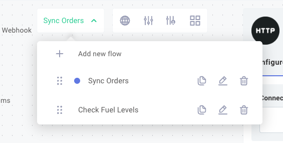
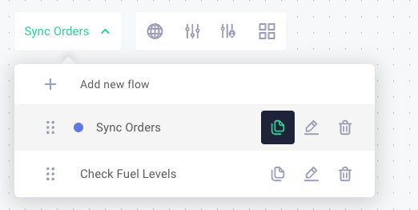

An %INTEGRATION% can contain multiple flows, each with its own trigger and sequence of steps to handle different events or webhook types.
This allows you to organize complex %INTEGRATION_PLURAL% into manageable, logical units that share configuration but execute independently.

## Flows in %INTEGRATION_PLURAL%

Some %INTEGRATION_PLURAL% contain a single **flow** (one trigger and a series of steps that execute sequentially).
For %INTEGRATION_PLURAL% requiring multiple logical flows - such as when integrating with an application that sends various webhook payload types - you can combine multiple flows into a single %INTEGRATION%, with each flow handling a specific webhook type.
This approach is more manageable than splitting the work across many separate %INTEGRATION_PLURAL%; instead, a single %INTEGRATION% composed of multiple flows shares one config wizard and one set of credentials.

An %INTEGRATION%'s [config variables](./config-wizard/config-variables.md) are scoped at the %INTEGRATION% level.
Therefore, config variables set for an %INTEGRATION% are shared and accessible by any of the %INTEGRATION%'s flows.
Each flow has its own unique trigger and its own webhook URL for invoking that specific flow.

## Managing flows

To add a new flow to your %INTEGRATION%, click the **+ Add new flow** button at the top of the designer.

To edit a flow, click your current flow's name, then click the pencil icon to the right of the flow.
Each flow should have a unique name and may include an optional description.

To delete a flow from an %INTEGRATION%, click the trash icon to the right of the flow's name and description.

## Cloning a flow

When you need to add a flow similar to an existing one, you can **clone** (copy) the flow.
To clone a flow, open the flow menu by clicking the flow name at the top of the designer.
Then, select the clone flow button and provide a new name for the copy.

## Switching between flows

To switch between flows, click the flow name at the top of the designer to open the flow menu.
Select the flow you want to view or edit.

Each flow is tested independently.
When you click the **Run** button, only the currently displayed flow will execute.
Note that each flow has a distinct webhook URL, so if you are invoking the %INTEGRATION% from a third-party app via webhook, you'll need to use the URL for the specific flow you want to invoke.
