## Overview

This tutorial will walk you through some basic concepts of %INTEGRATION% development using the %COMPANY_POSSESSIVE% %EMBEDDED_DESIGNER%.

- Fetch user data from an API
- Learn how data flows between steps of an %INTEGRATION%
- Use a loop to iterate over the users you fetch
- Use logical branches to make decisions based on user properties
- Take different actions based on user characteristics
- Make the %INTEGRATION% reusable across multiple %INSTANCE_PLURAL% using a [Config Wizard](./config-wizard/overview.md)

## %INTEGRATION% overview

The %INTEGRATION% you build here will fetch a list of users from an API, loop over each user, check if they're from a specific geographic region (south or north of the equator), and take different actions based on their location.

We'll use the JSONPlaceholder API `https://jsonplaceholder.typicode.com/users`, which provides sample user data.

## Start building

We'll start by creating a new %INTEGRATION%.
Log in to [%COMPANY_CORE_PRODUCT%](%APP_LOGIN_URL%), then %NAVIGATING_TO_BUILDER%.

Create a new %INTEGRATION% by clicking **+ Add Integration** and selecting **Get Started**.
Give it a name and select a trigger for the first flow.

### Configure the flow trigger

Each flow in your %INTEGRATION% has its own trigger.
This first flow will run on a schedule.
When prompted, select **Schedule** as your trigger and configure your flow to run on a daily basis at a time of your choosing.

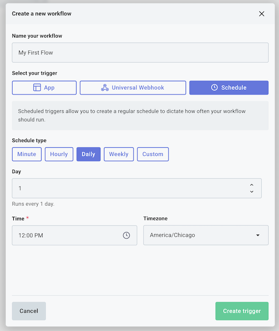

> **Note:** Your schedule trigger will be active once you finish building and [enable](./enabling.md) your %INTEGRATION%.
> For now, you can test your flow as you build it by clicking the **Run** button at the bottom of the canvas.

### Fetch user data from an API

Next, add a new step to your flow by clicking the **+** button below your trigger.
Search for the **HTTP** component and add a **GET Request** step.

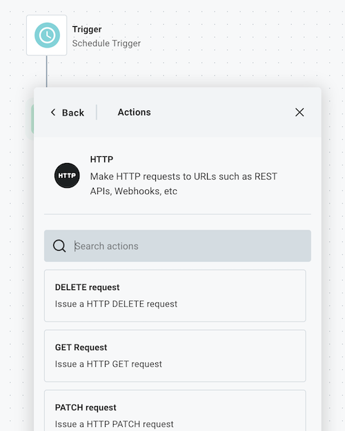

Rename the step to **Get Users**.
Configure your step to fetch user data from the JSONPlaceholder API.
JSONPlaceholder does not require authentication, so no connection is required.
In the **URL** field, enter: `https://jsonplaceholder.typicode.com/users`

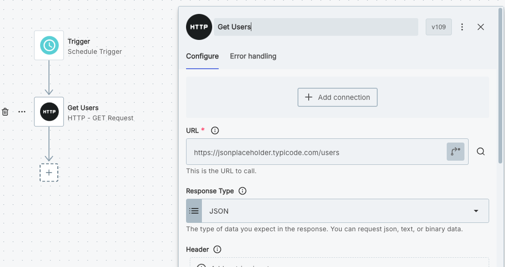

Click the green **Run** button to test your %INTEGRATION% so far.
If you select the **Get Users** step in your test results, you will see the user data that was fetched from the API in the **Output** tab.

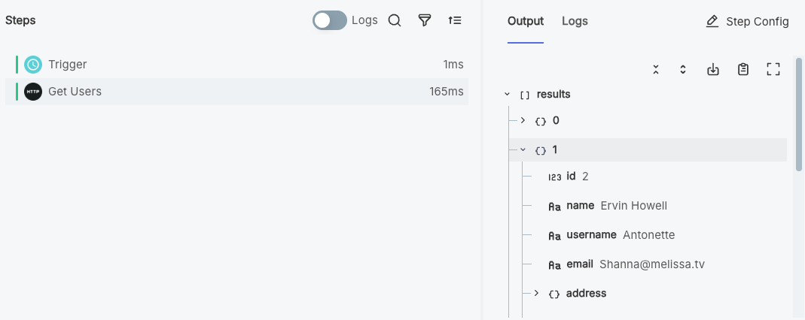

### Loop over the users

Now that we're fetching a list of users, we need to loop over each user to process their information.
Add another step under your **Get Users** step, this time searching for the **Loop** component and its **Repeat for Each** action.

Name your step **Loop Over Users**.
Configure your loop step to iterate over the user data from the previous step.
In the **Items** field, click **Configure Reference** and select the `data` property (or `body` property) of the **Get Users** step.

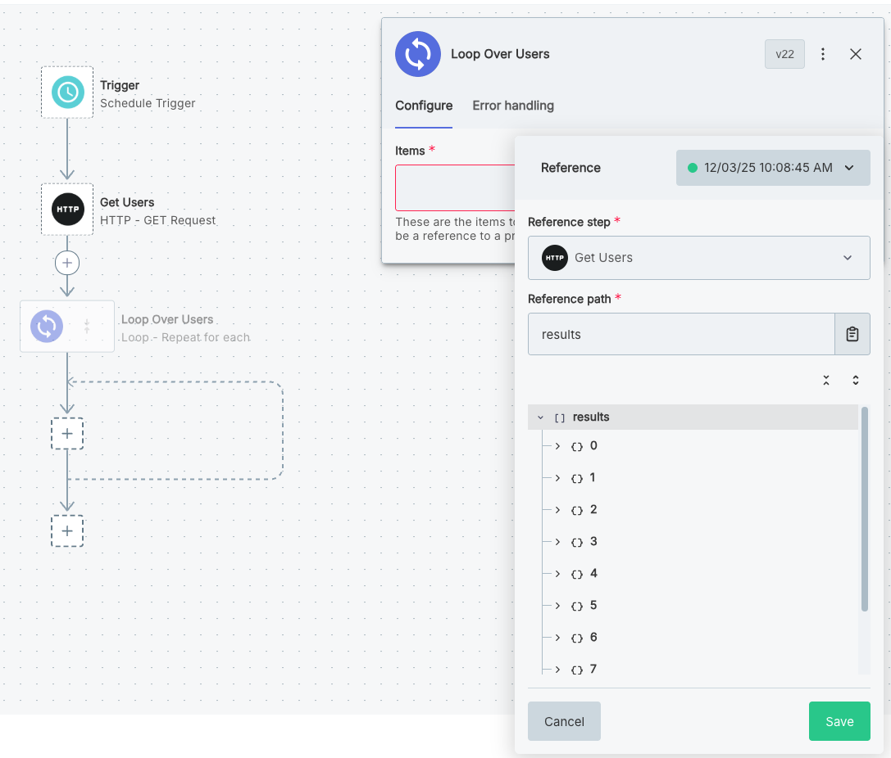

Run a test of your flow again.
This time, you'll see that the loop step has a `currentItem` property in its output that contains the data for the current user being processed.
We'll use this property in the next step to check the user's location.

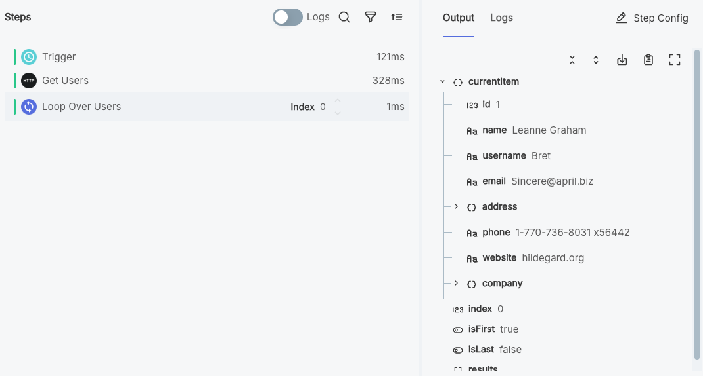

### Branch based on user's location

Now that we're looping over each user, we need to check their address to see if they're from a specific region.
Looking at the user data, each user has an `address` object with a `geo` property containing latitude and longitude coordinates.
We'll use the latitude to determine if they live south of the equator (latitude < 0).

Add a step within your loop, this time selecting the **Branch** component, **If Condition is Met** action.
Name the step **Check User Location**.

Configure the branch step to have a condition called **Is Southern User?**.
In the **Field** input, click **Configure Reference** and select the loop step's `currentItem.address.geo.lat` property.
Under **Operator** select **is less than**.
In the **Value** field, enter `0`.

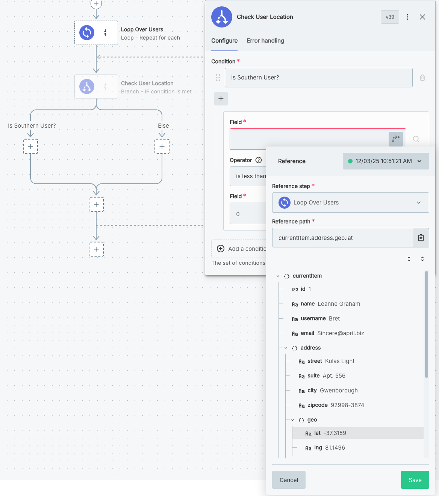

Now, users with latitude less than 0 (southern hemisphere) will follow the **Is Southern User?** branch, while users from the northern hemisphere will follow the **Else** branch.

If we run our %INTEGRATION% once more and look at our **Loop Over Users** step again, we can see that the branch step followed the **Is Southern User?** branch for the first three items, then the **Else** branch once, etc.

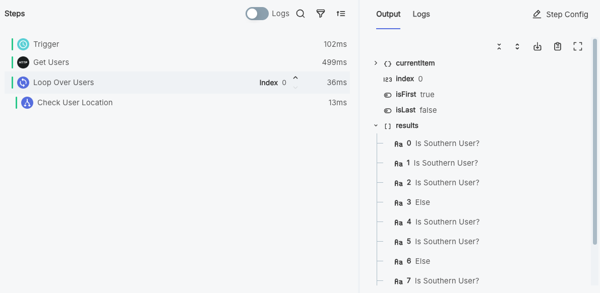

### Handle users in each branch

Under the **Is Southern User?** branch, add a **Log** step.
Create a friendly log message announcing the user by name.
You can reference the user's name from the loop step's `currentItem.name`.

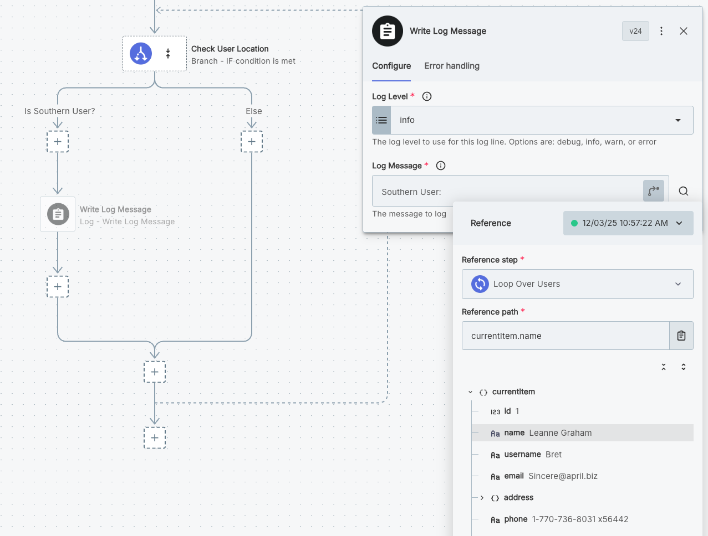

Add a similar log step to your **Else** branch.

If you toggle **Logs** on in the test runner drawer and increment the **Index** of your loop step, you can view the log message that each loop iteration yielded.

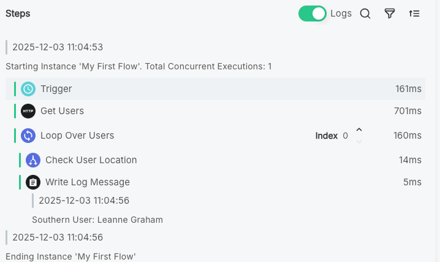
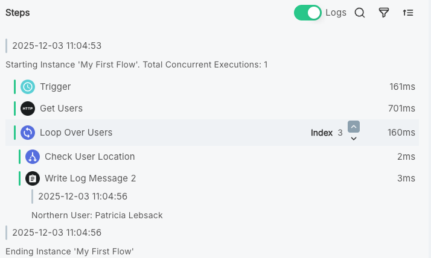

## Make the %INTEGRATION% configurable

Now that we have a working flow, let's make it configurable so we can deploy multiple %INSTANCE_PLURAL% (for example, one for development and one for production) without rebuilding the %INTEGRATION% each time.
The %EMBEDDED_DESIGNER% lets you build a [Config Wizard](./config-wizard/overview.md) - a set of pages and config variables you fill in each time you deploy a %INSTANCE%.

Click the **Config Wizard** button at the top of the designer.
Add a config variable called **API Endpoint** with a **String** data type and a default value of `https://jsonplaceholder.typicode.com/users`.

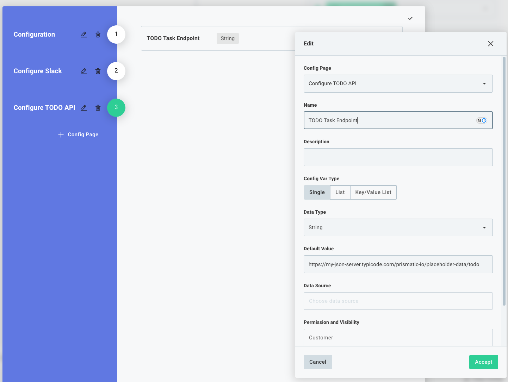

Update your **Get Users** step to use the **API Endpoint** config variable as the URL instead of a hard-coded value.

Run a test of your %INTEGRATION% again and verify that it still works as expected.
Now you can supply a different API endpoint each time you deploy a new %INSTANCE%.

## Next steps

Congratulations! You created your first %INTEGRATION%!
While a little contrived, this %INTEGRATION% demonstrates how to fetch data from a third party, loop over lists of records, and use branching logic.

Here are a few things you should try next:

- **Add another flow**: An %INTEGRATION% can contain [multiple flows](./flows.md), each with its own trigger.
- **Modify the branching logic**: Try branching on different user properties like company name, email domain, or website.
- **Add external actions**: Instead of just logging, [send emails](./connectors/sendgrid.md#sendemail) to users, create records in a [database](./connectors/postgres.md#query), or post to a chat system like [Slack](./connectors/slack.md#postmessage).
- **Add more complex processing**: Parse user data and validate email formats using a [code](./custom-code.md) step, or enrich user information with additional API calls.
- **Add error handling**: Use [step-level error handling](./error-handling.md#step-level-error-handling) to handle potential errors gracefully.
