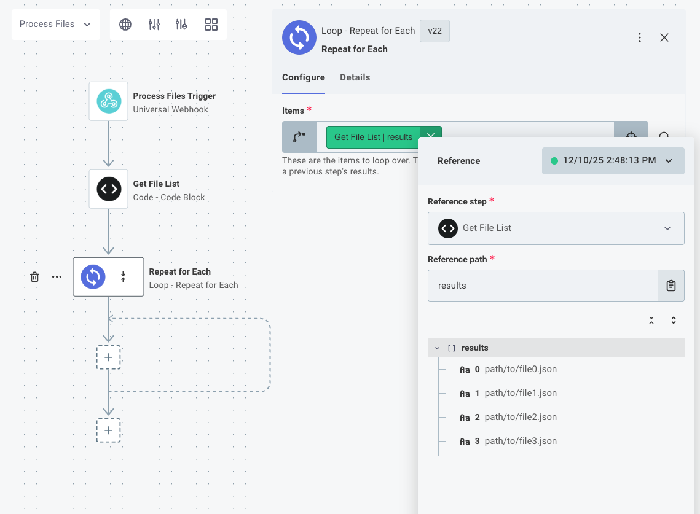
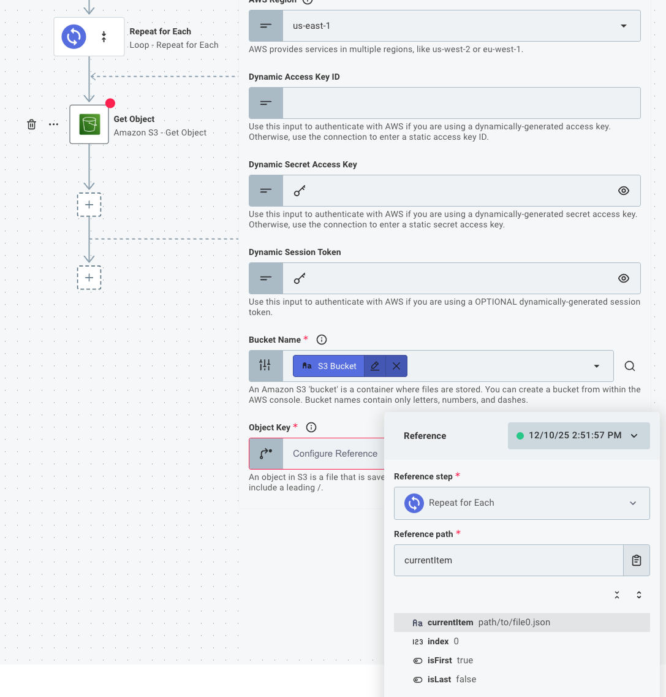
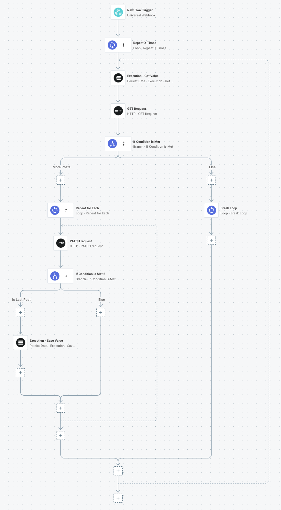

For many flows, it's useful to be able to loop over an array of items or to loop a certain number of times.
If your flow processes files on an SFTP server, for example, you might want to loop over an array of files on the server.
If your flow sends alerts to users, you might want to loop over an array of users.

The [loop connector](./connectors/loop.md) allows you to loop over an array of items, or you can loop a predetermined number of times.
After adding a **loop** step to your flow, you can then add steps within the loop that will execute over and over again.

The **loop** connector takes one input: **items**.
**Items** is an array - an array of numbers, strings, objects, etc.
For example, one step might generate an array of files that your flow needs to process.
Its output might look like this:

```json
[
  "path/to/file1.txt",
  "path/to/file2.txt",
  "path/to/file3.txt",
  "path/to/file4.txt"
]
```

The loop connector can then be configured to loop over those files by referencing the `results` of the **list files** step:



Subsequent steps can reference the loop step's `currentItem` and `index` parameters to get values like `path/to/file3.txt` and `2` respectively:



## Looping over lists of objects

The list of objects passed into a loop step can be as simple or complex as you like.

In this example, if we have a loop named **Loop Over Users**, and the loop was presented **items** in the form:

```json
[
  {
    "name": "Bob Smith",
    "email": "bob.smith@example.com"
  },
  {
    "name": "Sally Smith",
    "email": "sally.smith@example.com"
  }
]
```

Then the loop will iterate twice - once for each object in the list, and we can write a [code step](./custom-code.md) that accesses the loop's `currentItem` and `index` values and sub-properties of `currentItem` like this:

```javascript
module.exports = async (
  { logger },
  { loopOverUsers: { currentItem, index } },
) => {
  logger.info(`User #${index + 1}: ${currentItem.name} - ${currentItem.email}`);
};
```

That will log lines like `User #1: Bob Smith - bob.smith@example.com`.

## Looping over a paginated API

Many third-party APIs limit the number of records you can fetch at once and let you load a batch (or "page") of records at a time.
You may need to loop over an unknown number of pages of records in a flow.

You can accomplish that with a combination of two loops (one to loop over pages and one to loop over records on each page) and a [break loop](./connectors/loop.md#breakloop) action that stops loading pages when there are no more left to load:



## Return values of loops

A loop will collect the results of the **last** step within the loop and will save those results as an array.
For example, if the loop is presented the list of JSON-formatted user objects [above](#looping-over-lists-of-objects), and the last step in the loop is a code step reading:

```javascript
module.exports = async (context, { loopOverUsers: { currentItem } }) => {
  return { data: `Processed ${currentItem.email}` };
};
```

Then the `result` of the loop will yield:

```json
["Processed bob.smith@example.com", "Processed sally.smith@example.com"]
```
