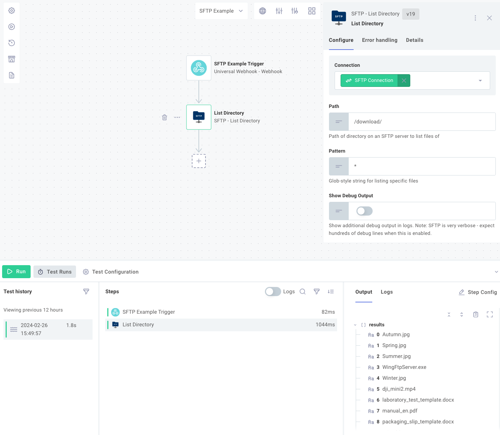
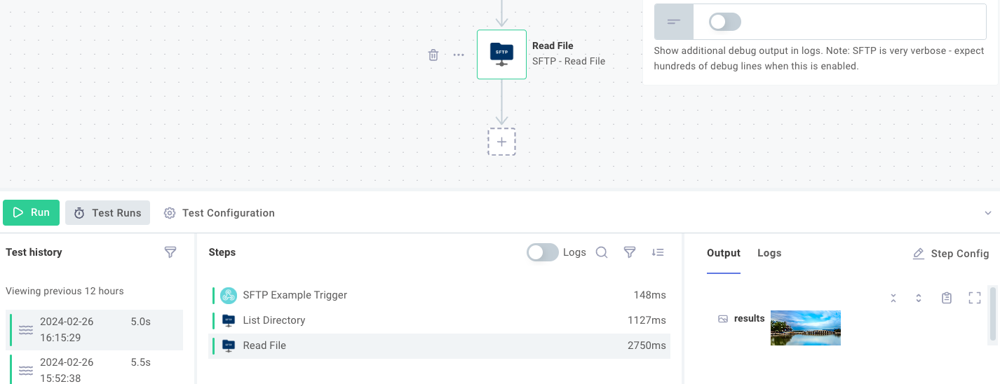
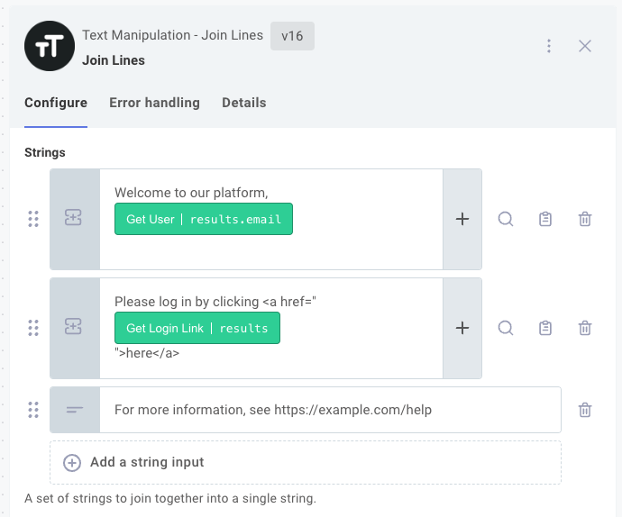
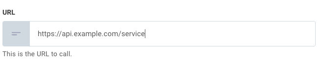
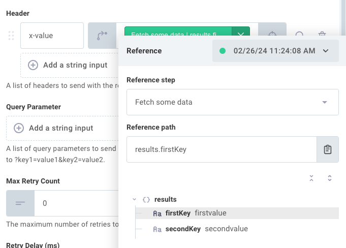
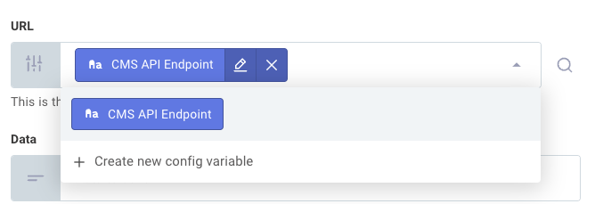
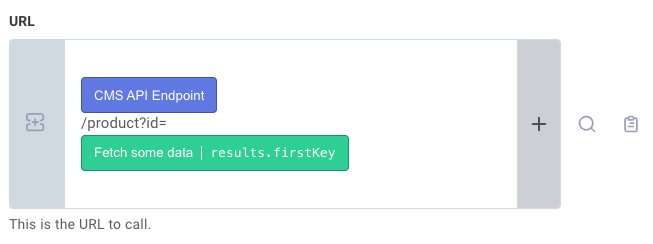
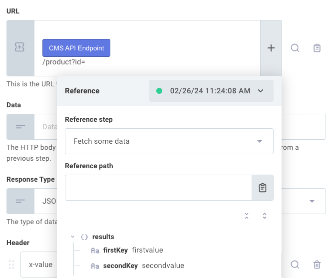

One of the core concepts in building %INTEGRATION_PLURAL% is understanding how data flows from one step to the next.
Each step can produce outputs that become available as inputs for subsequent steps, enabling you to build complex data transformation pipelines.

## Step outputs

When a step runs, it may output data that subsequent steps can consume as input.
For example, an SFTP **List Files** step outputs an array of file names.



An SFTP **Get File** step outputs the contents of a file retrieved from an SFTP server (in this case, an image).



Outputs take one of three forms:

- A primitive value, like a **string**, **boolean**, **number**, or **array** of primitives.
  A subsequent step that references this output will receive the string, boolean, number, or array as input.
- An **object**.
  An output might include multiple key-value pairs:

  ```json
  { "key1": "value1", "key2": ["value2.0", "value2.1", "value2.2"] }
  ```

  You might see this after retrieving JSON from an HTTP endpoint.
  Specific values from an object can be referenced as inputs using familiar JavaScript `.dot` and `["bracket"]` notation.
  Using the above example, to access `value2.1`, you would reference `results.key2[1]`.

- A **binary file**.
  Binary file outputs contain a combination of a file `Buffer` and content type (like `"image/png"`) in the form:

  ```json
  {
    "data": "<Buffer>",
    "contentType": "image/png"
  }
  ```

> **Note:** An action can return a combination of JSON and binary file(s) if properties of the JSON object are objects with `data` and `contentType` properties.

## Configuring step inputs

After adding a step to your flow, you will typically need to configure inputs for that step.
Inputs might include a RESTful URL endpoint, an S3 bucket name, a Slack webhook to invoke, or even a binary file such as an image or PDF to upload or process.

Some inputs are required and denoted with a `*` symbol, while others are optional.

Inputs can take one of four forms: **value**, **reference**, **config variable**, or **template**.
**Value** inputs are static strings, **reference** inputs reference the results of a previous step, **config variable** inputs reference [config variables](./config-wizard/config-variables.md) whose values can vary per %INSTANCE%, and **template** inputs allow you to concatenate static strings, config variables, and step result references.

> **Tip: Use the Join Lines action for multi-line input values**
>
> If you need to enter multiple lines of text for an input value, you can use the [Join Lines](./connectors/text-manipulation.md#joinlines) action to concatenate multiple lines of text into a single string.
>
> 

### Value inputs

A **value** is a simple string (perhaps a URL for an HTTP request).
When you set a **value** for an input, that static value will be used as input for every %INSTANCE% you deploy.



### Reference inputs

A **reference** is a reference to the output of a previous step.
For example, if a previous step retrieves a file from Amazon S3 and the step is named **Fetch my file**, then you can reference **Fetch my file** as input for another step, and that subsequent step will receive the file that **Fetch my file** returned.

Outputs from one step can be referenced by a subsequent step by referencing the previous step's `results` field.
For instance, if a previous step returned an object - such as when an **HTTP - GET** action retrieved JSON reading `{ "firstKey": "firstvalue", "secondKey": "secondvalue" }` - you can access that `firstvalue` property in a subsequent step's input by selecting the **HTTP - GET** step and choosing `results.firstKey` in your **Reference search**.



### Config variable inputs

A **config variable** references one of the %INTEGRATION%'s [config variables](./config-wizard/config-variables.md).
For example, you can select a config variable, `CMS API Endpoint`, as input for one of your steps.
Config variables can be set independently per %INSTANCE%, so each %INSTANCE% you deploy can use a different `CMS API Endpoint`.



### Template inputs

A **template** is a combination of string values, config variables, or step result references.
You can concatenate several strings, config variables, and step results together to serve as a single input.

Templates are useful when an input needs to be composed from various config variables and step results.
For example, suppose you want to make an HTTP request to an API endpoint that is stored as a config variable and fetch an item whose ID was obtained in a previous step.
You could combine the API endpoint, URL path, and product ID like this:



A static string, like `/product?id=`, can be intermixed with config variables and step result references.

You can add references to config variables or step results by clicking the **+** button.


