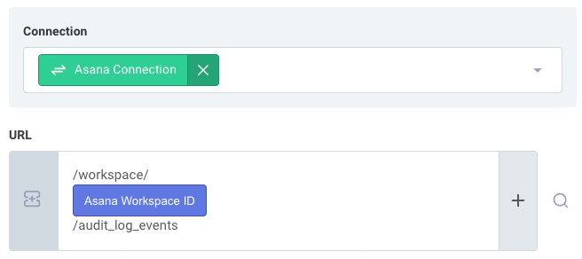
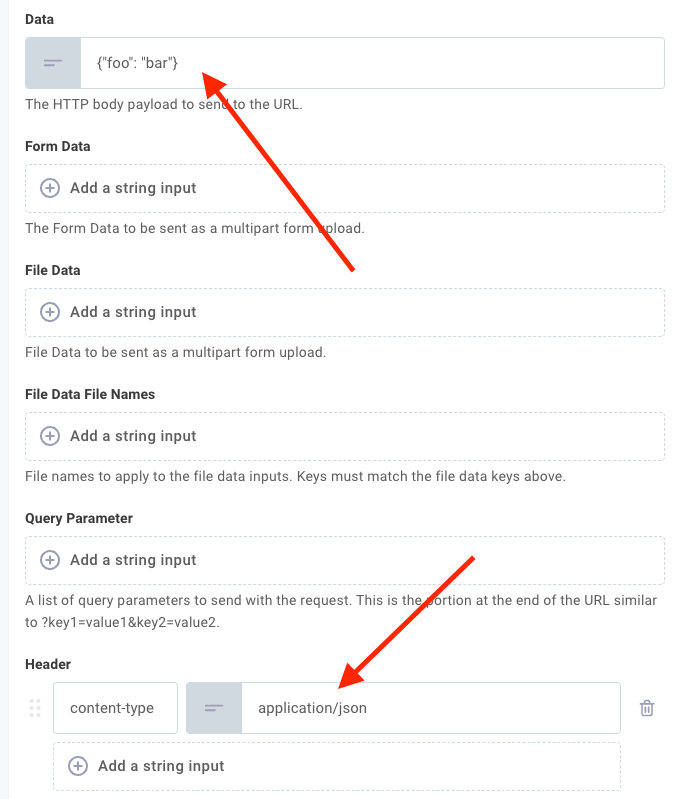
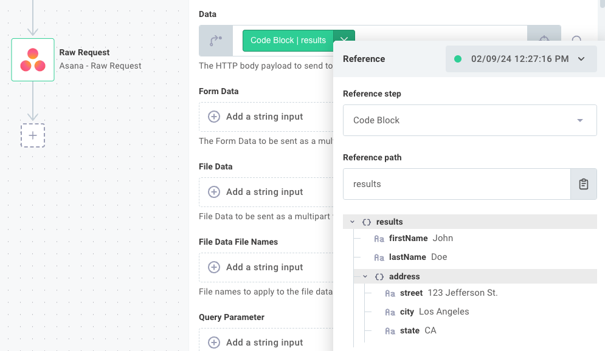
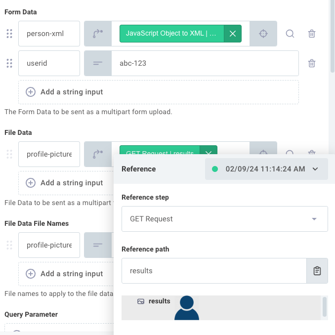
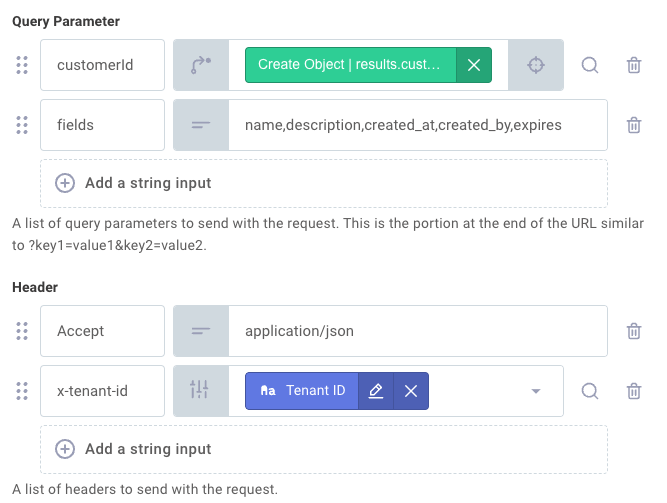
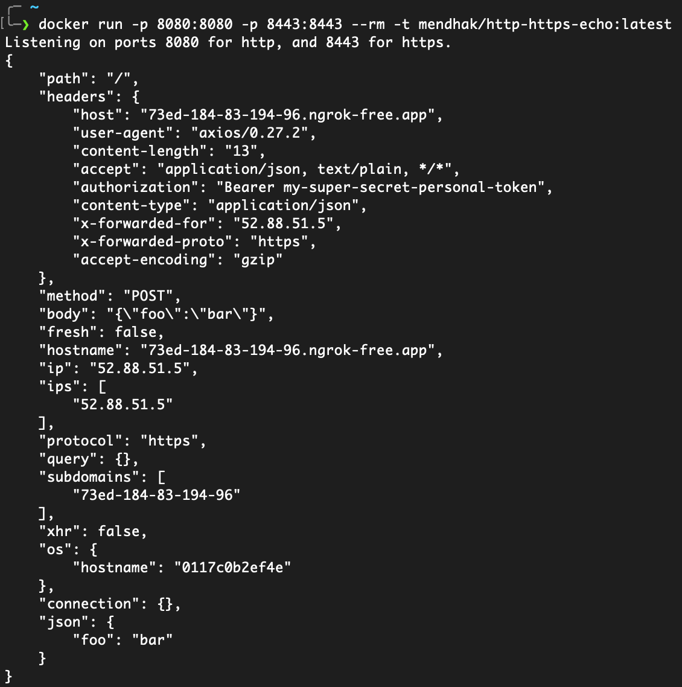
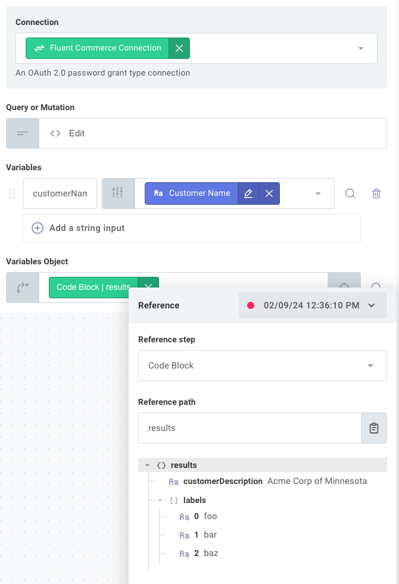

Connectors contain actions that wrap a large number of API endpoints.
But some APIs are vast with thousands of endpoints (only some of which are relevant to %INTEGRATION_PLURAL%).
Not every endpoint that an app offers is represented by an action in the connector.

That's where an **HTTP Raw Request** action is useful.
Raw request actions allow you to send a request to any endpoint that an API offers, using an HTTP client that is already authenticated with the third-party.
Most built-in connectors include raw request actions, and depending on the API they may include an action for generic HTTP requests or an action for GraphQL requests.
This document details how to use raw request actions in your %INTEGRATION%.

## Determining what endpoint to specify

You can determine the endpoint URL to use by looking at the API's documentation.
For example, the [Asana API documentation](https://developers.asana.com/reference/rest-api-reference) lists all of the endpoints that they offer.
To [Get audit log events](https://developers.asana.com/reference/getauditlogevents) from Asana, you need to send a GET request to `https://app.asana.com/api/1.0/workspaces/{workspace_gid}/audit_log_events`.

The Asana connector helper text notes that it fills in the base URL `https://app.asana.com/api/1.0` for you.
So, you would need to construct the remaining `/workspaces/{workspace_gid}/audit_log_events` portion of the URL.



The comments and example you see when you first input the URL are provided by the connector developer and let you know what the base URL is and what the rest of the path should look like.

> **Tip: Override a raw request base URL**
>
> You can override a raw request base URL by specifying a fully qualified URL in the URL input.
> For example, if you wanted to send a request to `https://my-api.example.com/some/endpoint` from the Asana raw request action, you can specify that full URL in the URL input and the connector's base URL will be ignored.

## Sending JSON to an API using raw request

The majority of modern APIs expect JSON data in the request body.
You can send JSON data to an API using a raw request action by constructing a JSON string in the `data` input.

> **Note: Include a content-type header**
>
> Most JSON-based APIs require that you specify a `content-type` header of `application/json` when sending JSON data.
> Otherwise, you may see an error from the API that the request body is not valid JSON.
> If you reference a JavaScript object in the `data` input, the action will automatically set the `content-type` header to `application/json` for you.
> If you specify a JSON string, manually include the `content-type` header in the `Headers` input.
>
> 

Additionally, you can reference a JavaScript object in the `data` input, and the action will automatically convert it to a JSON string for you.
This is useful if you have a code step that constructs a JavaScript object that you want to send to the API.



## Sending non-JSON text to an API using raw request

For non-JSON text data, like XML, CSV, etc., you can use the [Change Data Format](./connectors/change-data-format.md) connector to serialize data into the appropriate format.
Like JSON data, ensure that you specify an appropriate `content-type` header (e.g. `text/csv`, `application/xml`, etc.).

## Sending form data to an API using raw request

Form data inputs are useful for sending data to APIs that expect a content type `application/x-www-form-urlencoded`.
Form data is largely used when you need to send several types of data in a single request, such as a file along with some metadata.

To send form data, first ensure that you have cleared the `data` input - you can't send both data and form data together.
Then, specify form data key/value pairs.
In the below example, we send both a simple string `userid` and an XML payload `person-xml`.
We also send a file `profile-picture` by referencing a picture from a previous step, and we give the file a name using the `File Data File Names` input:



> **Warning: Serialize JSON before sending**
>
> Unlike the `data` input, form data inputs cannot accept JavaScript objects.
> Serialize the JavaScript object into a JSON string (or XML string, etc.) before referencing it.

## Sending custom parameters and headers using raw request

The `Query Parameters` input allows you to specify custom query parameters to send to the API (that's the `?key=value` portion of the URL).
While you could specify query parameters in the URL input through a [template input](./passing-data-between-steps.md#template-inputs), string concatenation is prone to encoding issues.
The `Query Parameters` input ensures that your query parameters are properly URI-encoded.

The `Headers` input allows you to specify custom headers to send to the API.
In addition to the usual `Content-Type` header, you may need to specify other headers like `Accept` or a custom header like `X-Tenant-ID`.



## Response data types for raw request actions

The `Response Type` input allows you to specify how you would like the response data to be formatted.

- `json` is the default response type and will return the response data as a JavaScript object.
  This type assumes that the API returns `application/json` response data.
- `text` will return the response data as a string.
  This type assumes that the API returns `text/plain`, `text/html`, or other text-based response data.
- `arraybuffer` is used when you expect a binary file response.
  Use this if you expect a file, like a PDF, image, etc.

## Debugging raw request actions

If you're having trouble with a raw request action, you can toggle the `Debug` input to see the full request and response data in logs (remember to toggle it back before deploying to production!).
This is useful for debugging issues with the request body, headers, etc.

It is also useful to use a tool like [Postman Echo](https://learning.postman.com/docs/developer/echo-api/) to echo back the request that you're sending.
To use Postman echo, set the URL to `https://postman-echo.com/post` and the `HTTP Method` to `POST`.
The raw request step's result will contain the full request data that you sent, which you can compare to the API's documentation to ensure that you're sending the correct data.

Another tool that is useful for debugging raw requests is the [mendhak/http-https-echo](https://hub.docker.com/r/mendhak/http-https-echo) Docker image.
This Docker container will print and echo any request that it receives.



> **Tip:** If you can get an HTTP request to work in a tool like `curl` or [Postman](https://www.postman.com/) but cannot get it to work in a raw request action, send both the raw request and Postman request to your echo endpoint.
> Comparing the two requests side-by-side can help you identify what is different between the two requests.

## Sending GraphQL requests using raw request

Some APIs, like [Fluent Commerce](./connectors/fluent-commerce.md), are GraphQL-based.
These built-in connectors generally have `Generic GraphQL Request` actions that you can use to send GraphQL requests.

The generic GraphQL request action has a `Query or Mutation` input, which is the GraphQL query or mutation that you want to send.
It's wise to parameterize queries and mutations using variables (to avoid QL-injection issues).

Most generic GraphQL request actions have a `Variables` input, which is a key/value input where you can specify variables and their values that your mutation uses.
It also generally includes a `Variables Object` input if you would like to provide a key/value object from a previous step.
`Variables` and `Variables Object` are merged together and can be used in tandem.

For example, suppose we want to send this mutation:

```graphql
mutation myMutation(
  $customerName: String!
  $customerDescription: String!
  $labels: [String]
) {
  createCustomer(
    input: {
      name: $customerName
      description: $customerDescription
      labels: $labels
    }
  ) {
    id
  }
}
```

You could reference `customerName` from a previous step but also supply `customerDescription` or `labels` from a previous step using the `Variables Object` input:



> **Tip: Construct GraphQL queries first using a GraphQL client**
>
> GraphQL APIs often offer a web-based GraphQL explorer where you can construct queries and mutations.
> We recommend using a GraphQL client tool to construct your query or mutation first and then copy/pasting it into the `Query or Mutation` input.
