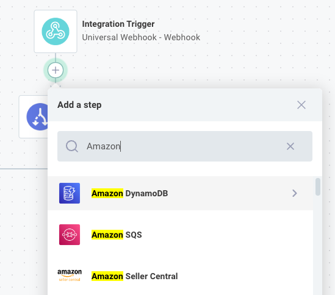
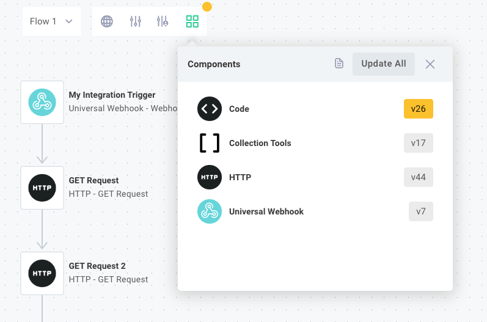
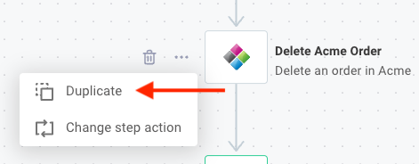
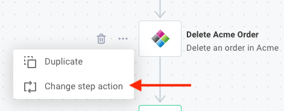
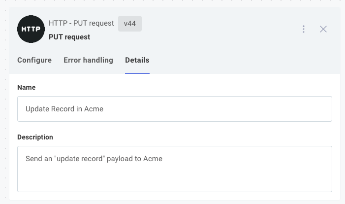
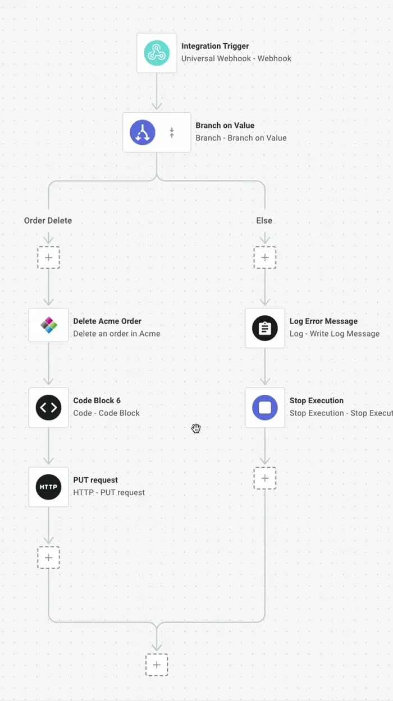

A flow consists of a series of steps that execute in order, with each step performing a specific action like fetching data, transforming it, or sending it to another system.
Understanding how to add, configure, and connect steps is fundamental to building %INTEGRATION_PLURAL%.

## Flow steps

Actions, like downloading a file from an [SFTP server](./connectors/sftp.md) or posting a message to [Slack](./connectors/slack.md), are added as **steps** of a flow.
Steps are executed in order, and outputs from one step can be used as inputs for subsequent steps.

Steps run in order from top to bottom.
You can add conditional logic to your flow with a [branch](./branching.md), or run a series of steps over a data set in a [loop](./looping.md).
If one step throws an error, the flow stops running unless you have configured [error handling](./error-handling.md) for that step.

## The trigger step

The first step of every flow is the **trigger** step, which determines when that flow will run.
The [triggering](./triggering.md) article details how triggers work and how to invoke your flow.

## Adding steps to a flow

To add a step to a flow, click the **+** icon underneath the trigger or another action.

Select the connector and action you would like to add to your flow.
For example, you can choose the **Amazon DynamoDB** connector and then select the **Create Item** action.
You can begin to type the name of the connector or action you would like to add to filter the list.

### Choosing connector versions

Connectors are versioned.
You can choose a version of each connector that works for your %INTEGRATION%.
"Pinning" connector versions for your %INTEGRATION% prevents accidental regressions if a new version of a connector is published that contains breaking changes.

To choose what version of each connector your %INTEGRATION% uses, click the **Component Versions** button on the right side of the designer.

You can choose to run the latest version of a connector or any previous version.
Connectors running the latest available version will be marked in grey, while connectors running an outdated version will be marked in yellow.

To change the version of a connector your %INTEGRATION% uses, click the **CHANGE VERSION** button to the right of the connector you want to change and select a version from the dropdown.

## Cloning steps

To make a copy of a step in your flow, click the **...** button next to the step and then select **Duplicate**.

This will copy the step, including any inputs you've configured for the action.

## Changing step actions

To change the action that a step uses, click the **...** button next to the step and then select **Change Step Action**.

You will be prompted to select a different action and then will be prompted to fill in that new action's inputs.

## Changing step names

By default, steps are uniquely named after the action they invoke (so they're named things like **CSV to YAML** or **Delete Object**).
To override that default name, click the step and open the **Details** tab in the step configuration drawer.

Like using descriptive variable names in a program, renaming steps allows you to give your steps descriptive names.
Rather than `HTTP - PUT`, you could give your step a name like **Update Record**.
We recommend giving your steps descriptive names and descriptions so your team members can read through %INTEGRATION_PLURAL% and understand their purpose more readily.

## Reordering steps

Steps execute in series.
To reorder steps, click and drag a step up or down.

