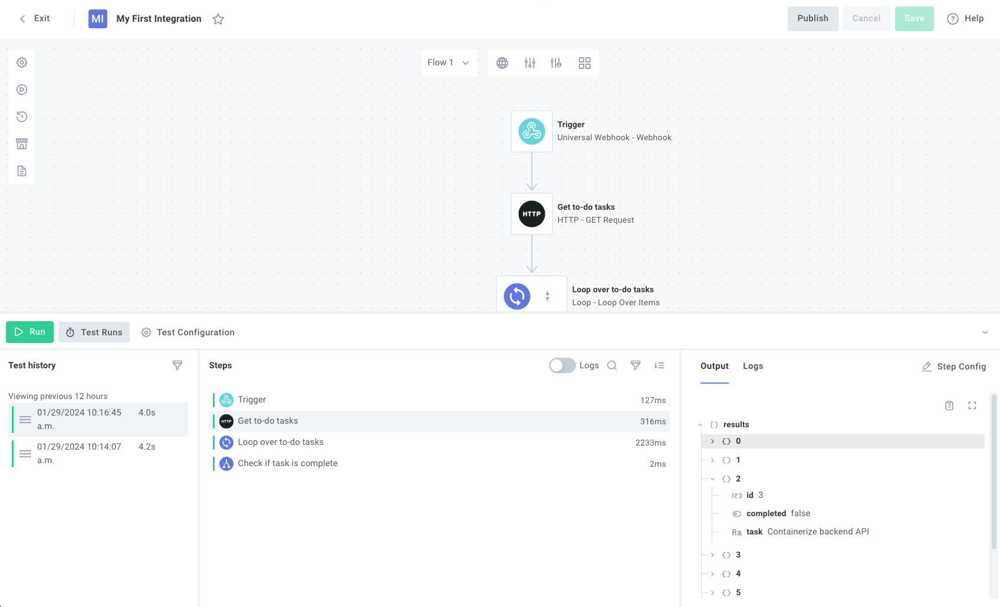
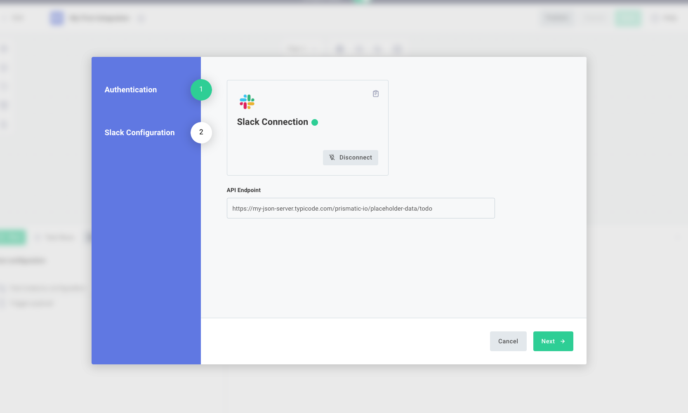
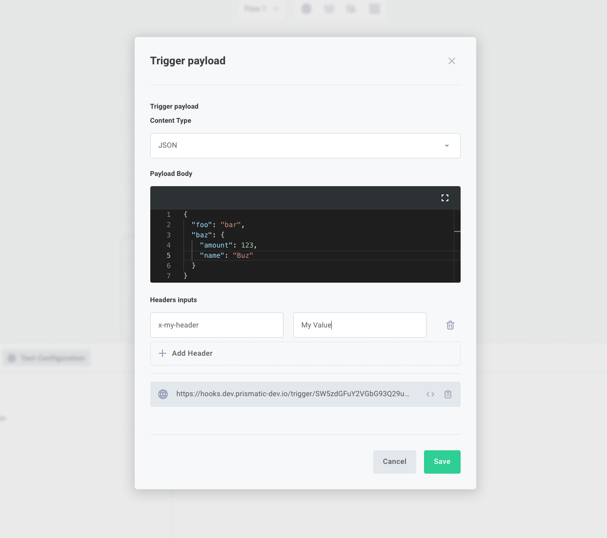
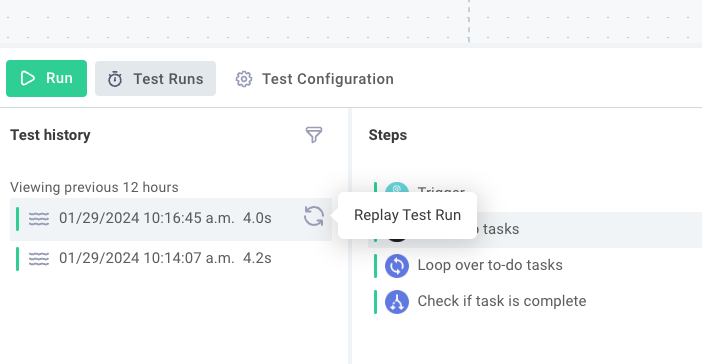

The %EMBEDDED_DESIGNER% provides a sandbox for testing %INTEGRATION_PLURAL%.
From the designer, you can run a test of any flow, configure test values for config variables, and view test logs in real time.

You can test your flow after you set test values for config variables by clicking the green **Run** button at the bottom of the designer.

If your %INTEGRATION% is made up of [multiple flows](./flows.md), each flow is tested independently.
Click the flow name on the top of the designer area, select the flow you would like to test, and then click **Run** for that flow.
Note that each flow has a distinct webhook URL, so if you are invoking the flow from a third-party app via webhook, you'll need to note the flow's webhook URL.

## The test runner drawer

The test runner drawer is where you can configure and run tests of your flow.
It's located at the bottom of the designer screen.

## Test %INSTANCE% config variables

If your %INTEGRATION% uses [config variables](./config-wizard/config-variables.md), you can specify testing values for those variables by clicking **Test Configuration** in the **Test Runner** drawer and selecting **Test-instance configuration**.
You will be prompted to fill out the same configuration wizard you'll see when deploying a real %INSTANCE% of your %INTEGRATION%.

If you specified default values for your config variables, those will be preset for you.
Otherwise, fill in testing values and connection information for the purposes of testing your %INTEGRATION%.

We recommend that you create testing, non-production sandbox credentials for tests.

## Running a test of your flow

To run a test of your flow, click the green **Run** button in the **Test Runner** drawer.
If you would like to send data to your flow's trigger as a webhook payload, you can specify that payload in the **Test Configuration** tab by clicking **Trigger payload**.

Within the trigger payload dialog, you can also specify custom HTTP headers to be sent with the webhook request.
If you would like to invoke your flow from an external system (i.e. send a webhook from your app or a third-party system), copy the webhook URL that is displayed in the **Trigger payload** dialog and send HTTP requests to that endpoint.

## Replaying test invocations

> **Tip: Save time by replaying tests**
>
> You can replay a test invocation.
> That comes in handy if you are testing your flow with a webhook from a third-party app.
> You don't need to set up your third-party environment every time - you can send a webhook invocation once with a payload and run that same payload through your flow until you're happy with the results.

To replay a test invocation, open the **Test Runner** drawer and select a test that you'd like to replay.
Click the replay button to the right of the test.

The payload that was sent to trigger this test will be fed back into another test of the flow.
This allows you to make changes to your %INTEGRATION% and iterate quickly, without needing to reconfigure your third-party apps and services to fire new webhook requests over and over.

## Test run results and logs

After running a test, the steps that ran are displayed in the **Steps** column of the **Test Runner** drawer.
You can toggle the **Logs** option to show logs for each step that ran.

Clicking on a step will display the step's outputs and logs in the third column.
This is helpful for debugging and verifying the flow of data within your %INTEGRATION%.
